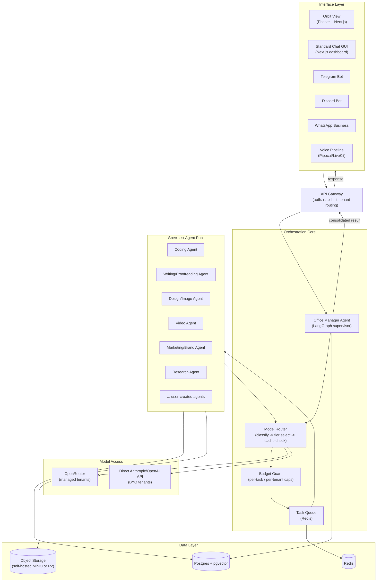
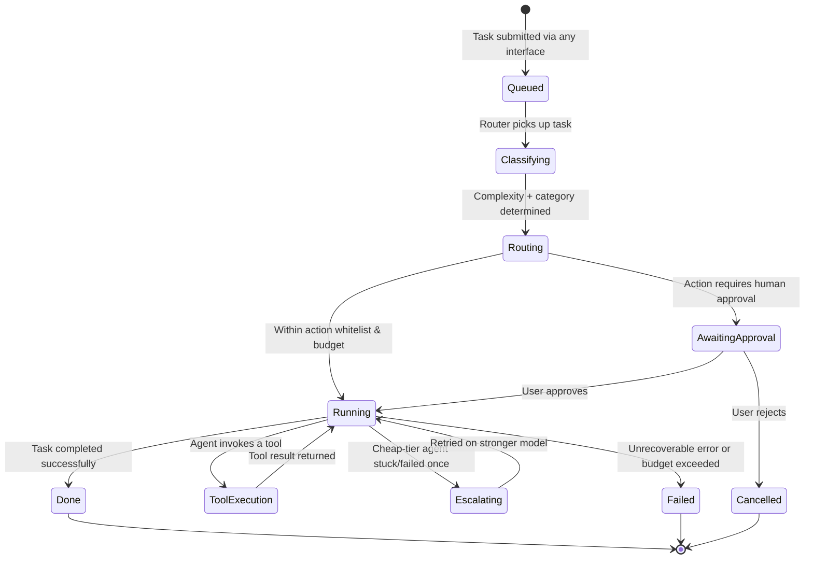
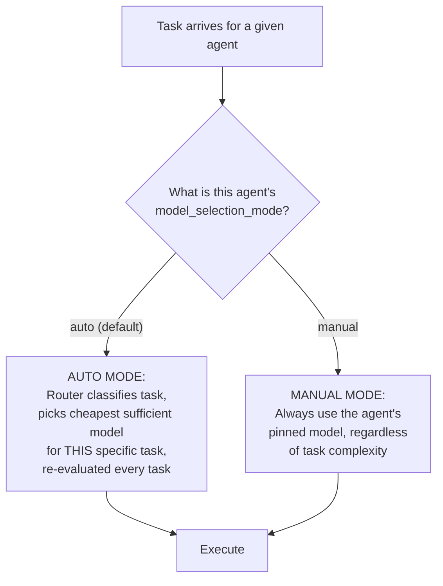
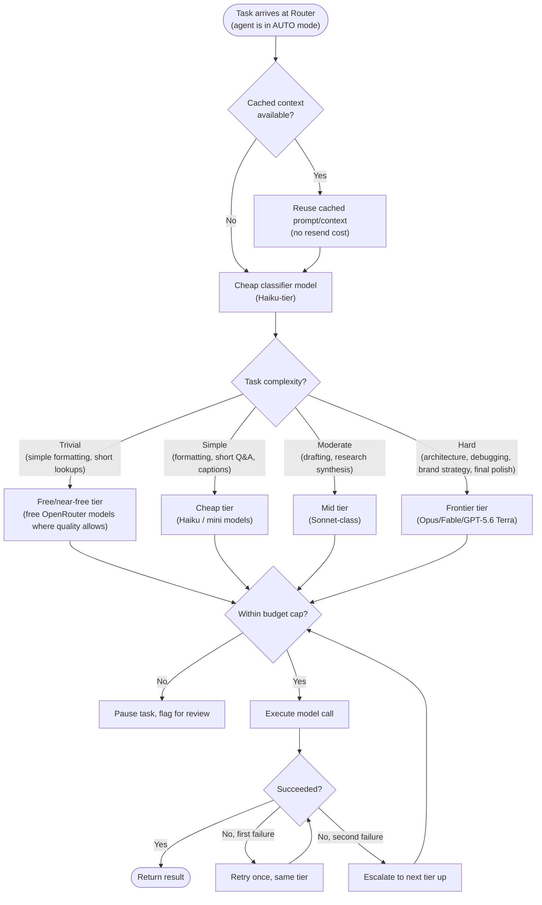
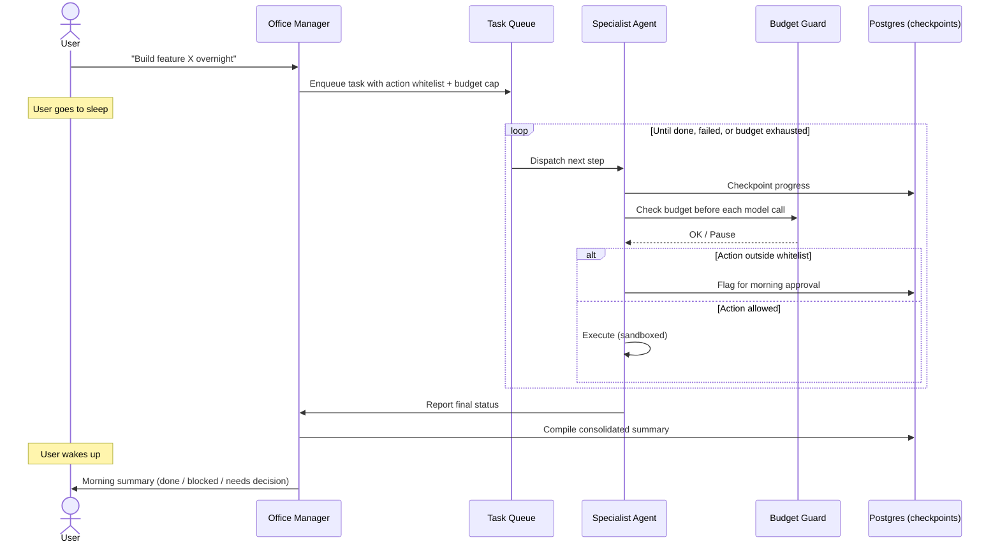
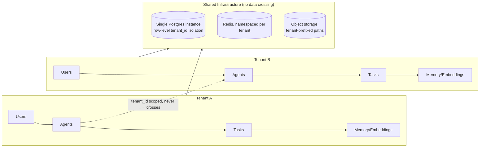
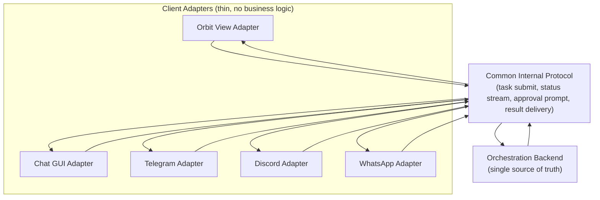
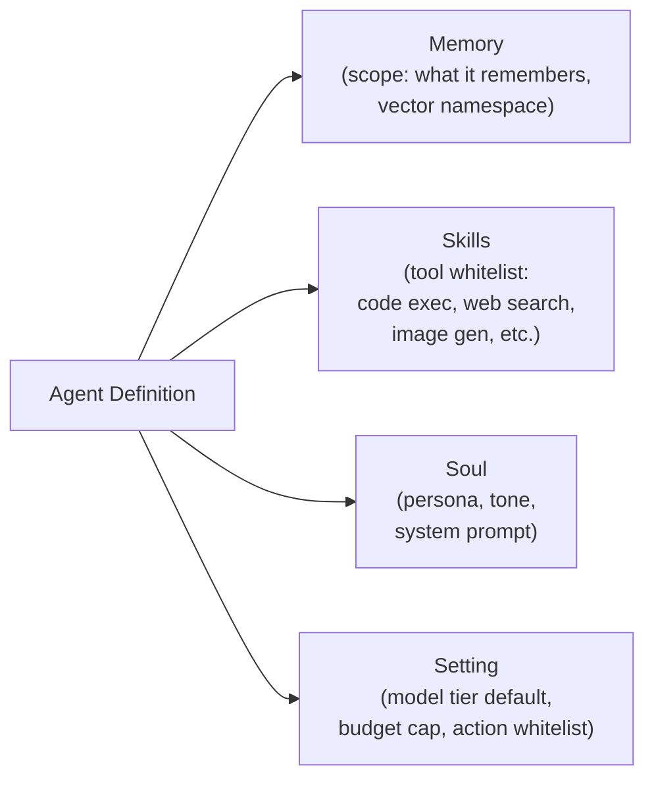

# System Design

Part of the AI Employee Office Platform documentation set. See `00_INDEX.md` for the full document list.

---

## 1. Design principles

1. **One backend, many faces.** No agent logic ever lives inside a specific UI/channel. Orbit View, standard GUI, Telegram, Discord, WhatsApp — all are thin clients over the same API.
2. **Router before spend.** No task reaches an expensive model without first passing a cheap classification step.
3. **Every long-running task is resumable.** Overnight autonomy requires checkpointed state, not in-memory-only execution.
4. **Tenant isolation is structural, not incidental.** Multi-tenancy is a first-class dimension of the data model from day one, not retrofitted.
5. **Prefer open source, swap-in components over monoliths.** Every layer below has a stated primary choice and a fallback, so no single vendor/project outage blocks the whole system.

---

## 2. High-level architecture



---

## 3. Component responsibilities

| Component | Responsibility | Primary tech |
|---|---|---|
| API Gateway | Authenticates requests, resolves tenant ID, applies rate limits per pricing tier | Custom (Next.js API routes or a lightweight Fastify/Express service) |
| Office Manager Agent | Receives normalized task input, plans, decides which specialist agent(s) are needed, consolidates results | LangGraph supervisor graph |
| Model Router | Classifies task complexity/category, selects cheapest sufficient model tier, checks prompt cache | Custom service, LangGraph node |
| Budget Guard | Enforces hard per-task and per-tenant token/dollar ceilings before and during execution | Custom middleware around model calls |
| Task Queue | Holds queued/running/done task state; enables overnight async execution | Redis + BullMQ (Node) or Celery (Python) |
| Specialist Agents | Domain-specific workers with their own system prompt, tool whitelist, and model tier default | LangGraph nodes, each independently configured |
| Data Layer | Persists tenants, users, agents, tasks, memory embeddings, files, billing/usage | Postgres + pgvector, object storage, Redis |

---

## 4. Task lifecycle (state machine)

Mirrors the visible task states from the Agent Town reference UI (`queued → returning → sending → running → done/failed`), generalized for our backend:



---

## 5. Model selection modes — Auto vs. Manual, and per-agent overrides

This was previously implicit (the router "just decides"). It needs to be explicit, because customers need real control: some want to never think about models (Auto), some want to pin a specific agent to a specific model regardless of what Auto would pick, and both must coexist per-agent, not as one global switch.

### 5.1 The two modes



- **Auto mode (default for every agent unless changed)**: the Router classifies each task independently and picks the cheapest model that can do the job well — exactly the tiered routing already described in Section 5.2 below. This is the "best output at the lowest cost, decided per task" behavior you asked for — Auto isn't one fixed cheap model, it's a live decision that can still reach for a frontier model when a specific task genuinely needs it, while defaulting cheap otherwise.
- **Manual mode**: the customer pins a specific agent to a specific model (e.g., "my Coding Agent always uses Claude Opus, full stop, I don't want it downgraded even for simple tasks"). When set, the Router skips classification entirely for that agent — no wasted classifier call, and the pinned model is used every time, whatever the task.
- **This is set per-agent, not globally.** A tenant can run one agent in Auto (e.g., Research Agent — happy to let the router optimize cost) and another in Manual (e.g., a Coding Agent for a specific client who insists on frontier-only quality) simultaneously. This matches how a real office actually works — you don't dictate one policy to every employee, you match the policy to the job and the person.

### 5.2 Schema addition (extends `04_database_design.md` Section 2.3 `agents` table)

```sql
ALTER TABLE agents ADD COLUMN model_selection_mode TEXT NOT NULL DEFAULT 'auto';
-- 'auto' | 'manual'

ALTER TABLE agents ADD COLUMN pinned_model TEXT;
-- only used when model_selection_mode = 'manual'; e.g. 'claude-opus-4-8', 'gpt-5.6-terra'
-- NULL when mode = 'auto'
```

### 5.3 UI surface (extends `10_ui_ux_guide.md` Section 10, the agent config editor's "Setting" tab)

```
┌─────────────────────────────────────────────────────────┐
│  Setting tab                                                │
├─────────────────────────────────────────────────────────┤
│  Model selection:                                            │
│  ○ Auto — best output at the lowest cost, per task (default) │
│  ○ Manual — always use: [model dropdown ▾]                   │
│                                                                │
│  ℹ Auto mode picks the cheapest model that can handle each    │
│    task well, only reaching for premium models when a task    │
│    genuinely needs it. Manual mode skips that decision and     │
│    always uses your chosen model.                              │
└─────────────────────────────────────────────────────────┘
```

This directly answers "if user selects any specific model then it will use that" — Manual mode is exactly that override, available per agent, visible and editable in the same config screen as everything else about that agent.

---

## 6. Model routing decision flow (Auto mode detail)

This is the mechanism that keeps frontier-model usage cheap in aggregate when an agent is in Auto mode — see `02_cost_and_pricing.md` for the cost rationale.



---

## 7. Overnight autonomous execution flow

Directly implements the "hand off a project, sleep, wake up to a summary" requirement.



---

## 8. Multi-tenant isolation model



Row-level isolation (every table keyed by `tenant_id`, enforced via Postgres Row-Level Security policies) is sufficient through Phase 2. Schema-per-tenant or database-per-tenant is a Phase 3+ consideration, only if a specific enterprise customer's compliance requirements demand it — it adds real operational overhead that isn't justified earlier.

---

## 9. Interface layer — "one backend, many faces" in practice



Each adapter's only job: translate its channel's native format (Telegram message, Discord interaction, WhatsApp webhook, Orbit View's canvas-layer event) into the common protocol, and translate protocol responses back into that channel's native format. No adapter contains task logic, routing logic, or agent logic — that all lives once, in the backend.

---

## 10. Agent configuration model (Memory / Skills / Soul / Setting)

Adopting the pattern observed in the Agent Town reference UI, generalized as our agent config schema:



This maps directly to a `agents` table (see `04_database_design.md`) and is exposed in the UI as an editable config panel — the same shape whether the agent was created manually or proposed by the meta-agent (system-assisted agent creation).

**Important:** the "Memory" scope shown above is per-agent, but that alone does not prevent two different client projects from contaminating each other within the same agent's memory. See `11_hallucination_isolation_and_scaling.md` for the project-level isolation layer (a `projects` table sitting between tenant and task/memory) and the added "Verification" config field (groundedness checking, citation enforcement) needed before this system is trusted with real, separate client work.

---

## 11. Technology stack summary

| Layer | Choice | Why |
|---|---|---|
| Frontend framework | Next.js 16 + React 19 + TypeScript | Strong ecosystem, good SSR for dashboard-style pages; also the natural home for Orbit View's surrounding chrome (top bar, chat dock, decoration palette — see `18_orbit_view_game_ui.md` Section 10.1) alongside the canvas-rendered scene itself |
| Game/avatar layer | Phaser 3 + Tiled | Open source; auto-selects canvas/WebGL rendering; good tooling for the tile-and-sprite approach specified in `18_orbit_view_game_ui.md` Section 2 — chosen as a rendering engine on its own technical merits, not because it's what the Agent Town reference uses |
| Orchestration | LangGraph (Python) | Fine-grained control over routing, state persistence, checkpointing — needed for overnight autonomy |
| Task queue | Redis + BullMQ/Celery | Mature, simple, well-understood at small-to-mid scale |
| Primary datastore | Postgres + pgvector | One database for relational + vector data; simpler ops than a separate vector DB early on |
| Object storage | Cloudflare R2 | Zero egress fees — matters once generated files (video, docs, images) are pulled frequently |
| Model access | OpenRouter (managed) + direct provider APIs (BYO) | Aggregation for managed tenants, direct billing isolation for BYO tenants |
| Voice pipeline | Pipecat or LiveKit Agents | Open source, purpose-built for realtime STT→LLM→TTS loops |
| STT | Whisper (self-hosted) | Free, broad multilingual coverage; benchmark on real customer languages before final commit |
| TTS | ElevenLabs (quality) or Google Cloud TTS (cost) | Both cover a broad range of languages; benchmark naturalness on real customer languages before committing to one as default |
| Hosting | Hetzner (compute) + self-hosted Postgres | No managed-database vendor dependency — full control of backups, auth, and data location, per your explicit no-vendor-lock-in requirement. See `08_devops_and_deployment.md` Section 9. |

---

## 12. Open-source-first component map

> **License note**: since this platform is sold commercially, every component below has been checked for commercial-use permissions — see `16_open_source_licensing_compliance.md` for the full audit. Two flagged exceptions worth knowing before implementation: LangGraph's core library is MIT and free, but its separate server product (`langgraph-api`/Platform) requires a paid Enterprise license — only the core library is used here. LiteLLM's core gateway is MIT, but its Enterprise tier (SSO, RBAC, audit logs) is a separate paid license — build equivalent functionality in our own application layer instead.

Per your instruction to reuse open source wherever it genuinely covers the need:

| Need | Open source option we use | What we still build ourselves |
|---|---|---|
| Agent orchestration | LangGraph | The actual supervisor graph, router logic, budget guard — this is our core IP |
| Animated office UI | Custom-built (own IP, not forked) — see below | Everything: rendering, room/decor system, idle-behavior simulation, scripting sandbox — this is a from-scratch, brand-owned feature, not an Agent Town fork |
| Realtime voice pipeline | Pipecat / LiveKit Agents | Multilingual tuning for whichever languages real customers use, integration with our router |
| STT | Whisper | Accuracy benchmarking/fine-tuning on real customer languages if needed |
| Standard chat GUI | Open WebUI (evaluate as a base) or custom Next.js | Multi-tenant billing UI, agent management UI, task dashboard — likely custom since Open WebUI isn't built for multi-tenant SaaS billing |
| Vector memory | pgvector | Memory scoping/retrieval logic per agent |
| Messaging channels | Telegram Bot API, Discord.js, WhatsApp Cloud API | Our common protocol adapters |

The rule of thumb applied throughout: **use open source for undifferentiated infrastructure (orchestration primitives, game engine, voice pipeline plumbing, messaging SDKs); build custom only where the differentiation actually lives (routing/cost logic, multi-tenant billing, agent config UX, cost-transparency polish).**

**Correction from earlier drafts, stated plainly:** the table above previously listed the animated office UI as "Agent Town, forked UI layer only." This has been superseded — the product now builds its own spatial office UI (internally named **Orbit View**; full spec in `18_orbit_view_game_ui.md`) as original IP, not a fork of the reference project. Agent Town remains a legitimate reference for *mechanic* (in-world task assignment, visible execution states) and for *category of tooling* (Phaser as a rendering engine, per Section 11's stack table, is still a reasonable open-source choice), but no code, assets, or UI layer from Agent Town is forked or reused — the room system, idle-time agent behavior, decoration/branding system, and the sandboxed customization layer are all designed fresh for this brand, specified in full in `18_orbit_view_game_ui.md`.
