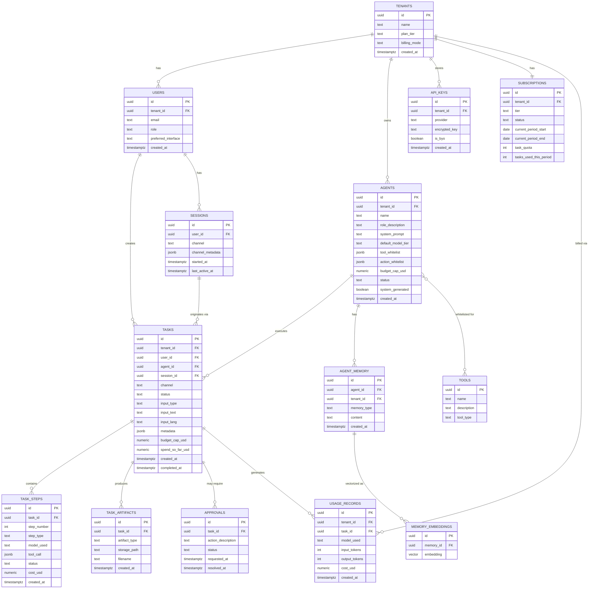
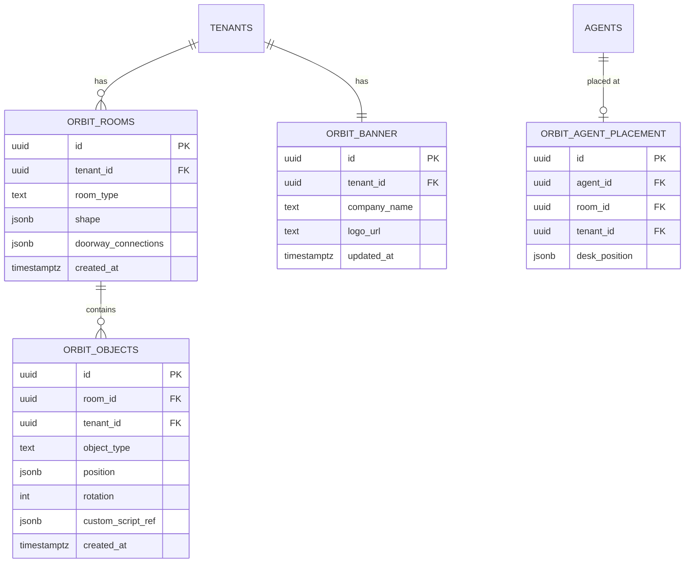

# Database Design

Part of the AI Employee Office Platform documentation set. See `00_INDEX.md` for the full document list.

Primary datastore: **self-hosted Postgres** with the **pgvector** extension for embeddings, running on infrastructure you control (see `08_devops_and_deployment.md` for the self-hosted setup). No managed-database vendor (Supabase or otherwise) is used — this avoids vendor lock-in and keeps full control of backups, auth, and data residency. Redis is used separately for the live task queue (ephemeral state), not covered here as a "database" in the traditional sense — see `03_system_design.md` Section 3.

---

## 1. Entity relationship overview



---

## 2. Core tables — purpose and key design notes

### 2.1 `tenants`

The root of multi-tenancy. Every other table (directly or transitively) is scoped by `tenant_id`.

- `billing_mode`: `'managed'` or `'byo'` — determines whether the router pulls from platform-owned OpenRouter credentials or the tenant's own stored key.
- `plan_tier`: references the pricing tiers from `02_cost_and_pricing.md` (`starter`, `growth`, `studio`, `enterprise`, or `byo_starter`, `byo_growth`, `byo_studio`).

### 2.2 `users`

- `preferred_interface`: the UI-switcher setting (`office`, `chat_gui`, `telegram`, `discord`, `whatsapp`) — but this is a *default*, not an access restriction; a user can act through any channel their tenant has enabled.
- `role`: `'owner' | 'admin' | 'member'` for multi-user tenants at the Studio tier and above.

### 2.3 `agents`

The heart of the "hire/fire your AI employees" feature.

- `tool_whitelist` (jsonb): array of tool identifiers this agent may invoke (maps to the `tools` table).
- `action_whitelist` (jsonb): which action *categories* can run unattended vs. require approval — e.g., `{"code_execution": "auto", "send_email": "approval_required", "publish_post": "approval_required"}`.
- `budget_cap_usd`: hard per-task ceiling enforced by the Budget Guard (see `03_system_design.md` Section 7).
- `system_generated`: boolean flag — `true` if this agent's config was produced by the meta-agent (system-assisted agent creation). System-generated agents should default to `status = 'pending_review'` until a human approves.
- `status`: `'active' | 'disabled' | 'pending_review'`.

### 2.4 `tasks`

- `channel`: which interface originated this task (`office`, `chat_gui`, `telegram`, `discord`, `whatsapp`, `voice`) — needed since a task can be *started* on one channel and *checked* on another (session continuity requirement).
- `input_type`: `'text' | 'voice' | 'image' | 'video' | 'live_cam'`.
- `input_lang`: `'en' | 'bn'` (or `'auto'` pre-detection) — drives which STT/TTS pipeline config is used.
- `status`: matches the state machine in `03_system_design.md` Section 4 (`queued`, `classifying`, `routing`, `awaiting_approval`, `running`, `escalating`, `done`, `failed`, `cancelled`).
- `spend_so_far_usd`: updated incrementally as `task_steps` accrue cost — this is what the Budget Guard checks against `budget_cap_usd` before allowing the next step.

### 2.5 `task_steps`

Append-only log of every discrete action within a task — this **is** the audit trail ("what did my AI employee actually do today") surfaced in the UI as an activity feed.

- `model_used`: exact model string called for this step — critical for cost analysis and for verifying the router is behaving as expected.
- `tool_call` (jsonb): structured record of any tool invocation (web search query, code executed, file written, etc.).

### 2.6 `agent_memory` + `memory_embeddings`

Split into two tables deliberately: `agent_memory` holds the human-readable content (for display and debugging), `memory_embeddings` holds the pgvector embedding for semantic retrieval, linked 1:1. This keeps the vector column narrow and lets you re-embed (e.g., after switching embedding models) without touching the source content.

- `memory_type`: `'fact' | 'preference' | 'brand_guideline' | 'past_decision' | 'conversation_summary'`.

### 2.7 `approvals`

Backs the human-in-the-loop gate required before any external/irreversible action, especially during unattended overnight runs.

- `status`: `'pending' | 'approved' | 'rejected' | 'expired'`.
- A task with any `pending` approval cannot proceed past that step — this is enforced at the orchestration layer, not just the UI.

### 2.8 `usage_records`

The billing source of truth. Every model call, regardless of which agent or task, writes one row here. Aggregated per tenant per billing period to compare against `subscriptions.task_quota` and to compute actual margin on managed-tier tenants.

### 2.9 `api_keys`

- `encrypted_key`: never stored in plaintext — encrypted at rest (see `06_security_and_scalability.md` for the encryption approach).
- `is_byo`: distinguishes a tenant-supplied key from a reference to the platform's own pooled key (in which case this table may simply not have a row, and the router falls back to platform credentials).

---

## 3. Indexing strategy

| Table | Index | Reason |
|---|---|---|
| `tasks` | `(tenant_id, status)` | Dashboard queries filtering "show me running/queued tasks for this tenant" |
| `tasks` | `(tenant_id, created_at DESC)` | Task history, pagination |
| `task_steps` | `(task_id, step_number)` | Ordered retrieval of a task's execution trace |
| `usage_records` | `(tenant_id, created_at)` | Billing period aggregation |
| `agent_memory` | `(agent_id, memory_type)` | Scoped memory retrieval before embedding search |
| `memory_embeddings` | `ivfflat` or `hnsw` index on `embedding` | pgvector similarity search performance |
| `agents` | `(tenant_id, status)` | "List my active agents" — the core agent-roster UI query |

For `memory_embeddings`, prefer an **HNSW** index over IVFFlat once pgvector's HNSW support is stable in your deployed Postgres version — better recall/latency tradeoff at the memory volumes expected here (thousands to low millions of vectors per tenant, not billions).

---

## 4. Row-Level Security (RLS) approach

Since Postgres RLS is the backbone of tenant isolation (see `03_system_design.md` Section 8):

```sql
-- Example pattern applied to every tenant-scoped table
ALTER TABLE agents ENABLE ROW LEVEL SECURITY;

CREATE POLICY tenant_isolation ON agents
    USING (tenant_id = current_setting('app.current_tenant_id')::uuid);
```

The application sets `app.current_tenant_id` at the start of every request (derived from the authenticated session, never from client-supplied input), and Postgres enforces the boundary at the database level — meaning even a bug in application-layer filtering can't leak cross-tenant data.

---

## 5. Data retention & lifecycle notes

- `task_steps` and `usage_records` are append-only and never deleted for active tenants — they're the audit trail and billing record.
- When an `agent` is deleted (`status = 'disabled'` then eventually hard-deleted after a grace period), its historical `tasks` and `task_steps` remain, with `agent_id` retained for audit purposes — matches the requirement "task history retained even after an agent is removed."
- `agent_memory` entries should carry an optional `expires_at` for short-term/conversational memory, distinct from long-term facts/preferences that persist indefinitely.

---

## 6. Why this schema, not a document store

Given the mixed structured (billing, task state) and semi-structured (agent config, tool calls) data, a pure document DB (Mongo-style) was considered and rejected as primary store: billing/usage integrity and multi-tenant RLS are much better served by Postgres's relational guarantees, while `jsonb` columns give the flexibility needed for `tool_whitelist`, `action_whitelist`, and `metadata` without needing a second database. This also keeps the "use fewer moving parts" principle from `03_system_design.md` intact — one Postgres instance, not Postgres + Mongo + a separate vector DB.

## 7. Important addition: project-level isolation

**This schema as originally specified only isolates by `tenant_id`.** If a single tenant (e.g., your own agency account) runs multiple client projects, nothing above structurally prevents one client's context from bleeding into another's during agent execution — tenant-level RLS doesn't address this, since both projects share the same tenant. This is a real gap, addressed in full in `11_hallucination_isolation_and_scaling.md`, which adds a `projects` table between `tenants` and `tasks`/`agent_memory`, with its own RLS-style scoping. Read that document before implementing multi-client workloads under a single tenant — it includes the exact schema migration needed.

## 8. Orbit View schema — spatial/presentational metadata only

Full feature spec in `18_orbit_view_game_ui.md`. These tables are **purely additive** and hold presentational/organizational metadata only — none of them are a source of truth for task or agent state, and none of them are read by the orchestration backend at all. This separation is deliberate and load-bearing: Orbit View reads live task/agent status from the exact same tables as the Standard Dashboard (`agents`, `tasks`, `task_steps`), so the two UI presentations can never disagree about what an agent is actually doing — only *where it's drawn* and *what it's decorated with* lives in this section.



### 8.1 `orbit_rooms`

One row per room a tenant has built. `room_type` is one of the curated types from `18_orbit_view_game_ui.md` Section 3 (`workroom`, `break_room`, `kitchen`, `lounge`, `washroom`, `entrance`, `meeting_room`). `shape` (jsonb) stores the room's tile-grid footprint (a simple rectangle or L-shape definition); `doorway_connections` (jsonb) lists which other rooms this one connects to and where the doorway sits on the grid.

### 8.2 `orbit_objects`

One row per placed decoration/furniture object — desks, chairs, plants, TVs, and so on, whether from the curated catalog or user-authored through the sandboxed scripting layer (`18_orbit_view_game_ui.md` Section 8). `object_type` references either a catalog item identifier or a custom decoration definition; `custom_script_ref` (jsonb, nullable) points to the sandboxed rendering definition when this object is user-scripted — **this column never stores executable code directly**, only a reference the client-side sandbox resolves, consistent with the hard safety boundary in `18_orbit_view_game_ui.md` Section 8 that custom scripting has no backend access at all.

### 8.3 `orbit_agent_placement`

Maps each agent to a home desk position within a room — purely organizational (e.g., grouping a Marketing team into one room). A missing row for a given `agent_id` simply means that agent hasn't been placed yet (falls back to an "unplaced" pool in the UI, not an error state). Deleting an `orbit_rooms` row cascades to null out any placements pointing at it, never to deleting the agent itself.

### 8.4 `orbit_banner`

One row per tenant — the company name/logo shown in the Orbit View entrance/lobby room per `18_orbit_view_game_ui.md` Section 7. `logo_url` is nullable (name-only banner is a valid, complete state); when set, it should reference either the tenant's own uploaded image or the Orbicrew/Leangine lockup files defined in `09_brand_identity.md` Section 6.5, depending on whether this is a white-labeled deployment.

### 8.5 Why idle-time wander state has no table

Per `18_orbit_view_game_ui.md` Section 10.2, an agent's moment-to-moment idle wandering position (walking toward the break room, sitting in the lounge, etc.) is **not persisted anywhere** — it's ephemeral, client-side simulation state recomputed on a coarse tick. Only meaningful, durable placement (`orbit_agent_placement`'s home desk) and task-driven status (already covered by the existing `tasks`/`task_steps` tables in Section 2) need to survive a page reload or a new session. This keeps the realtime/backend surface area small regardless of how lively the idle simulation looks on screen — the database has no idea an agent is "currently in the kitchen," and doesn't need to.

### 8.6 Indexing

| Table | Index | Reason |
|---|---|---|
| `orbit_rooms` | `(tenant_id)` | "Get this tenant's full office layout" — the core Orbit View load query |
| `orbit_objects` | `(room_id)` | Render all objects in a room |
| `orbit_agent_placement` | `(tenant_id)` | Render all agent desk positions across the office at once (used by Overview Map) |

### 8.7 Row-Level Security

All four tables follow the exact same tenant-isolation RLS pattern as Section 4 above — scoped by `tenant_id`, enforced at the database level. No table in this section is exempt from that policy.
