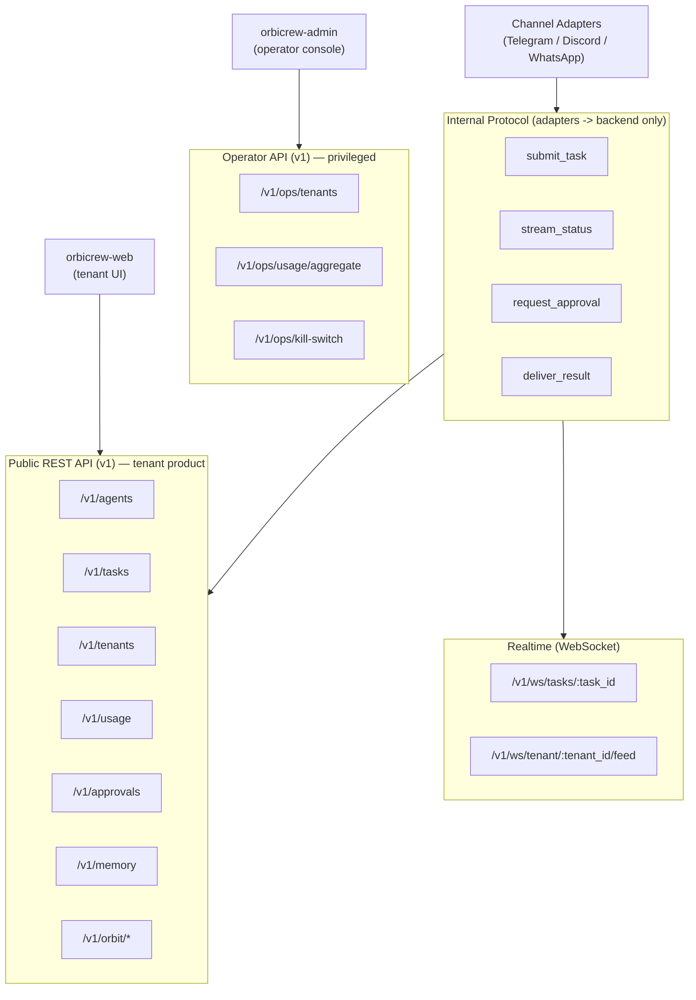
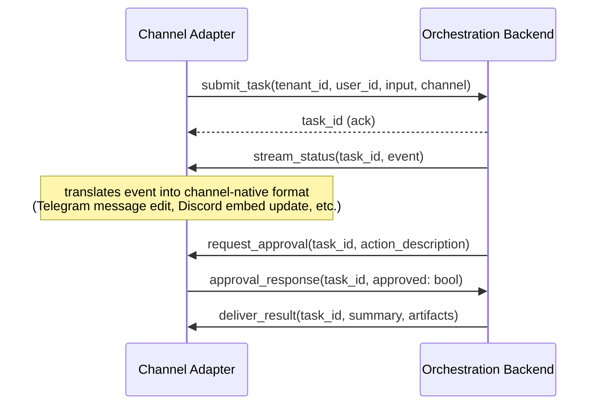

# API Design Guide

Part of the AI Employee Office Platform documentation set. See `00_INDEX.md` for the full document list.

---

## 1. API philosophy

- **REST for CRUD-style resources** (agents, tenants, tasks, users) — familiar, cacheable, easy for third-party integrators.
- **WebSocket for live task status streaming** — task execution is inherently long-running and event-driven (queued → running → done), polling is wasteful and slow to reflect the "visible execution" UX we want (mirroring the Agent Town reference's live bubbles/status).
- **A single common internal protocol** sits behind both — every channel adapter (Telegram, Discord, WhatsApp, Orbit View, chat GUI) talks to the same underlying task API; channel differences are handled entirely in the adapter layer, never in the API itself.

---

## 2. API surface overview



Tenant UI (`orbicrew-web`) and messaging adapters use the public/tenant-scoped API. The dedicated platform operator app (`orbicrew-admin`) uses **privileged operator endpoints** on the same `orbicrew-api` service — not a second backend, and not routes inside the web app.

---

## 3. Authentication & tenant resolution

- **Managed dashboard/API users (orbicrew-web):** standard session-based auth issuing a short-lived JWT, backed by a self-hosted open-source auth solution (see `08_devops_and_deployment.md` Section 9 for the recommended library) rather than a managed auth vendor, to avoid vendor lock-in; `tenant_id` embedded as a claim, never trusted from request body/query params.
- **Platform operators (orbicrew-admin):** separate operator identity and authz (Leangine staff only). Operator JWTs (or equivalent) carry an explicit operator role/claim and **must not** be interchangeable with tenant-user tokens. Operator calls hit `/v1/ops/*` (or equivalent privileged prefix) and are authorized independently of tenant RLS bypass rules.
- **Third-party/API integrators (future):** API key per tenant, scoped, revocable, rate-limited independently of the dashboard session.
- **Messaging channel adapters (Telegram/Discord/WhatsApp):** each incoming message is mapped to a `(tenant_id, user_id)` pair via a channel-identity linking table (e.g., a Telegram chat ID linked to a specific tenant user during onboarding) — the adapter authenticates itself to the backend with a service credential, then asserts the resolved user identity.

Every **tenant** request resolves to a `tenant_id` before touching the database — this is what the RLS policies in `04_database_design.md` rely on. Operator requests are explicitly privileged and audited; they do not impersonate a tenant JWT.

---

## 4. Core REST endpoints

### 4.1 Agents

| Method | Path | Purpose |
|---|---|---|
| `GET` | `/v1/agents` | List all agents for the authenticated tenant |
| `POST` | `/v1/agents` | Create a new agent (manual creation) |
| `GET` | `/v1/agents/:id` | Get one agent's full config (Memory/Skills/Soul/Setting) |
| `PATCH` | `/v1/agents/:id` | Update an agent's config |
| `DELETE` | `/v1/agents/:id` | Disable/remove an agent (soft-delete, history retained) |
| `POST` | `/v1/agents/generate` | Meta-agent: propose a new agent config from a natural-language description (returns a draft, does not activate) |
| `POST` | `/v1/agents/:id/activate` | Approve and activate a `pending_review` (system-generated) agent |

**Example — create agent request body:**

```json
{
  "name": "Social Media Writer",
  "role_description": "Writes Instagram/Facebook captions, matches brand tone, works in whatever language the request comes in",
  "system_prompt": "You are a social media copywriter specializing in...",
  "default_model_tier": "mid",
  "tool_whitelist": ["web_search", "image_search"],
  "action_whitelist": {
    "draft_content": "auto",
    "publish_post": "approval_required"
  },
  "budget_cap_usd": 2.00
}
```

### 4.2 Tasks

| Method | Path | Purpose |
|---|---|---|
| `GET` | `/v1/tasks` | List tasks for the tenant (filterable by status, agent, channel, date range) |
| `POST` | `/v1/tasks` | Submit a new task |
| `GET` | `/v1/tasks/:id` | Get full task detail including steps and artifacts |
| `GET` | `/v1/tasks/:id/steps` | Get the step-by-step execution trace (audit trail) |
| `POST` | `/v1/tasks/:id/cancel` | Cancel a queued or running task |
| `GET` | `/v1/tasks/:id/artifacts` | List/download generated files |

**Example — submit task request body:**

```json
{
  "input_type": "text",
  "input_text": "Write 5 Instagram captions for our new product launch",
  "input_lang": "auto",
  "channel": "chat_gui",
  "preferred_agent_id": null,
  "budget_cap_usd": 1.50,
  "allow_overnight": false
}
```

`preferred_agent_id` is optional — if omitted, the Office Manager agent decides routing. Setting `allow_overnight: true` signals this task may be queued for unattended execution rather than requiring an immediate synchronous response.

### 4.3 Approvals

| Method | Path | Purpose |
|---|---|---|
| `GET` | `/v1/approvals?status=pending` | List pending approvals for the tenant (the "morning inbox") |
| `POST` | `/v1/approvals/:id/approve` | Approve a queued action |
| `POST` | `/v1/approvals/:id/reject` | Reject a queued action |

### 4.4 Usage & billing

| Method | Path | Purpose |
|---|---|---|
| `GET` | `/v1/usage/summary` | Current billing period usage vs. quota |
| `GET` | `/v1/usage/records` | Detailed per-task cost breakdown |

### 4.5 Memory

| Method | Path | Purpose |
|---|---|---|
| `GET` | `/v1/agents/:id/memory` | List an agent's stored memory entries |
| `POST` | `/v1/agents/:id/memory` | Manually add a memory entry (e.g., paste brand guidelines) |
| `DELETE` | `/v1/agents/:id/memory/:memory_id` | Remove a memory entry |

### 4.6 Orbit View — room layout, decoration, and placement

Purely additive endpoints for the spatial office UI (full feature spec in `18_orbit_view_game_ui.md`). These manage presentational/organizational metadata only — they never touch task or agent execution state, per that document's Section 10.2.

| Method | Path | Purpose |
|---|---|---|
| `GET` | `/v1/orbit/layout` | Get the tenant's full office layout: rooms, doorway connections, placed objects, agent desk assignments |
| `POST` | `/v1/orbit/rooms` | Create a new room (type, shape, position on the grid) |
| `PATCH` | `/v1/orbit/rooms/:id` | Resize/move a room, or change its doorway connections |
| `DELETE` | `/v1/orbit/rooms/:id` | Remove a room (any agents/objects placed there fall back to unplaced) |
| `POST` | `/v1/orbit/objects` | Place a decoration/furniture object (type, room, position, rotation) — covers both curated catalog items and custom-scripted decorations from `18_orbit_view_game_ui.md` Section 8 |
| `PATCH` | `/v1/orbit/objects/:id` | Move/rotate a placed object |
| `DELETE` | `/v1/orbit/objects/:id` | Remove a placed object |
| `PATCH` | `/v1/orbit/agents/:agent_id/placement` | Assign or move an agent to a specific desk in a specific room (organizational only — no effect on agent config) |
| `GET` | `/v1/orbit/banner` | Get the tenant's company banner (name text, optional logo/image reference) |
| `PUT` | `/v1/orbit/banner` | Set/update the company banner |

**Example — place an object:**

```json
{
  "object_type": "desk",
  "room_id": "a1b2c3...",
  "position": { "x": 4, "y": 2 },
  "rotation": 0
}
```

**Note on custom scripting (Section 8 of `18_orbit_view_game_ui.md`):** any custom decoration created through the sandboxed scripting layer is still placed through this same `POST /v1/orbit/objects` endpoint — `object_type` can reference a custom decoration definition, but the API surface itself is identical to placing a catalog item. The sandboxing/safety boundary is enforced client-side in the rendering sandbox, not by a separate API — this endpoint only ever stores placement metadata (position, rotation, a reference to what to render), never executable code.

### 4.7 Platform operator endpoints (privileged)

Consumed by **`orbicrew-admin` only**. Implemented in `orbicrew-api` with operator authz — never exposed as unauthenticated or tenant-JWT-reachable routes.

| Method | Path | Purpose |
|---|---|---|
| `GET` | `/v1/ops/tenants` | List / search tenants (lifecycle support) |
| `GET` | `/v1/ops/tenants/:id` | Tenant detail for operators |
| `GET` | `/v1/ops/usage/aggregate` | Cross-tenant cost / usage aggregate |
| `POST` | `/v1/ops/kill-switch` | Platform-wide (or scoped) autonomous-execution halt |
| `DELETE` | `/v1/ops/kill-switch` | Clear platform-wide halt when safe |

Exact shapes land with Phase 2 operator work; the split above is the intended approach: one API, privileged prefix, dedicated admin client.

---

## 5. WebSocket protocol — live task status

Connecting to `/v1/ws/tasks/:task_id` streams events as the task moves through its lifecycle:

```json
{ "event": "status_change", "task_id": "...", "status": "running", "timestamp": "..." }
{ "event": "step_started", "task_id": "...", "step": { "type": "tool_call", "tool": "web_search", "query": "..." } }
{ "event": "step_completed", "task_id": "...", "step": { "cost_usd": 0.0021 } }
{ "event": "approval_required", "task_id": "...", "action_description": "Send email to client@example.com" }
{ "event": "task_completed", "task_id": "...", "artifacts": [ { "type": "document", "url": "..." } ] }
```

This is what powers both Orbit View's live status badges, orbit-ring delegation animation, and desk activity (per `18_orbit_view_game_ui.md` Section 4) and the standard GUI's task progress view — same event stream, different rendering. Orbit View's idle-time wandering/amenity behavior (`18_orbit_view_game_ui.md` Section 5) is deliberately **not** driven by this stream — it's ephemeral, client-side simulation with no backend involvement, per that document's Section 10.2 — only task-related state (queued/running/done/failed, cost) flows over this connection.

For the tenant-wide feed (`/v1/ws/tenant/:tenant_id/feed`), all task events across all of a tenant's agents are multiplexed onto one connection — used for the activity/audit dashboard and for the Digest aggregation (`03_system_design.md` §7).

---

## 6. Internal adapter protocol

The contract every channel adapter implements, regardless of channel:



This four-method contract (`submit_task`, `stream_status`, `request_approval`, `deliver_result`) is intentionally small — any new channel (Slack, email, a future custom app) only needs to implement these four operations against its own native message format to be fully supported, with zero changes to the orchestration backend.

---

## 7. Rate limiting & quota enforcement

Enforced at the API Gateway layer, before a request reaches the orchestration core:

| Tier | Enforcement |
|---|---|
| Starter / BYO Starter | Hard cap on tasks/month per `subscriptions.task_quota`; requests beyond quota return `429` with upgrade prompt |
| Growth / Studio and above | Soft cap with overage handling (configurable: block, or bill overage — decide per business rules at launch) |
| All tiers | Per-minute request rate limit regardless of plan, to protect infra from abuse/bugs (e.g., 60 requests/min/tenant) |

---

## 8. Versioning & stability

- All public endpoints prefixed `/v1/` — breaking changes ship as `/v2/`, old version maintained for a defined deprecation window once external integrators exist.
- Internal adapter protocol is versioned independently and can evolve faster since it's not third-party-facing.
- Webhook payloads (for future third-party integrations, e.g., a customer's own system reacting to task completion) should follow the same event shape as the WebSocket protocol, for consistency.

---

## 9. Error handling convention

Consistent error envelope across all endpoints:

```json
{
  "error": {
    "code": "budget_exceeded",
    "message": "Task cancelled: exceeded budget cap of $1.50 before completion",
    "task_id": "...",
    "retryable": false
  }
}
```

Standard `code` values to define early and use consistently: `budget_exceeded`, `quota_exceeded`, `approval_rejected`, `agent_not_found`, `unauthorized_tenant`, `model_provider_error`, `invalid_input`. Consistent codes let every channel adapter render sensible user-facing messages without needing to parse free-text error strings.
