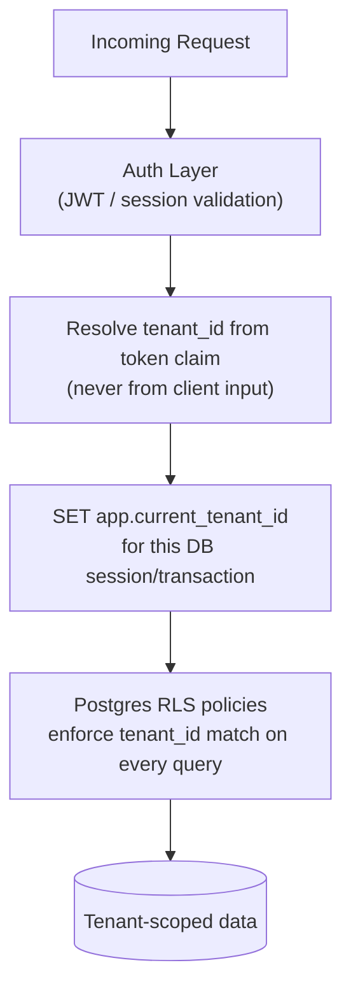
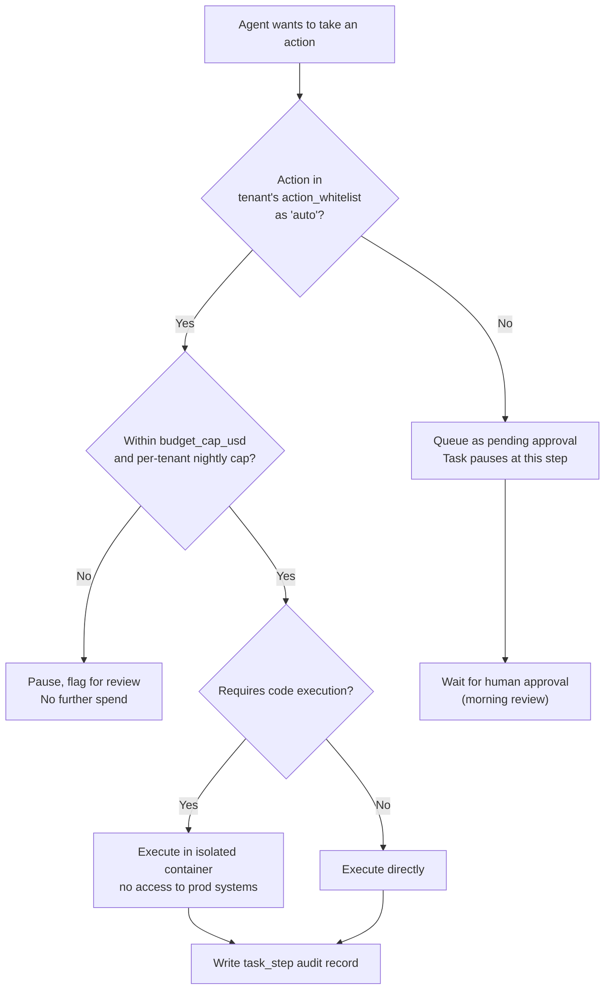
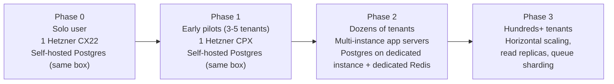

# Security & Scalability

Part of the AI Employee Office Platform documentation set. See `00_INDEX.md` for the full document list.

---

## 1. Threat model summary

> **See also `12_adversarial_security.md`** for a dedicated deep-dive on hackers, bad actors, and prompt injection specifically (using the OWASP Top 10 for Agentic Applications framework) — this document covers the broader architectural threat model; that one goes deep on the adversarial/injection surface.

Given the system handles customer API keys, autonomous overnight code/action execution, and multi-tenant data, the priority threats to design against are:

1. **Cross-tenant data leakage** (one customer sees/affects another's agents, tasks, or memory).
2. **API key exposure** (BYO customer keys, or platform's own pooled keys, leaking via logs, errors, or storage).
3. **Runaway autonomous execution** (an agent taking a costly, harmful, or embarrassing action unattended — sending a bad email, publishing bad content, spending excessive budget).
4. **Malicious or unsafe code execution** (a coding agent executing arbitrary code against real infrastructure instead of a sandbox).
5. **Prompt injection** (malicious content in a task, uploaded file, or scraped web page manipulating an agent into unintended actions).

Each is addressed below with a concrete mechanism, not just a policy statement.

---

## 2. Multi-tenant isolation (Threat 1)

- **Row-Level Security (RLS)** on every tenant-scoped table (detailed in `04_database_design.md` Section 4) — enforced at the database level so an application bug can't leak cross-tenant rows even if a query forgets a `WHERE tenant_id = ...` clause.
- **Redis namespacing**: all keys prefixed `tenant:{tenant_id}:...` — task queues, caches, rate-limit counters never share a namespace across tenants.
- **Object storage path prefixing**: `r2://bucket/{tenant_id}/...` — combined with per-tenant signed URLs for artifact downloads, never a shared/public path.
- **Vector memory namespacing**: `agent_memory`/`memory_embeddings` queries always filtered by `tenant_id` before similarity search, so semantic recall never surfaces another tenant's content even accidentally.

---

## 3. API key & secrets management (Threat 2)

- **Encryption at rest**: BYO customer API keys stored using envelope encryption (e.g., encrypted with a per-tenant data key, which is itself encrypted with a master key held in a secrets manager, not in application config). Never stored or logged in plaintext.
- **Platform's own pooled keys** (for managed-tier tenants) held in a secrets manager (e.g., environment-injected via the hosting provider's secrets store, or a dedicated tool like Doppler/Infisical — both have generous free tiers suitable for Phase 0–1), never committed to source control, never exposed to the frontend.
- **Redaction in logs**: any logging middleware must redact known secret-shaped fields (API keys, tokens) before writing logs — a single shared redaction utility used everywhere logging happens, not ad hoc per call site.
- **Scoped, revocable keys**: if/when the platform issues its own API keys to customers (for third-party integration use), each key is individually revocable and scoped to specific permissions, never a single shared master credential.

---

## 4. Guardrails for autonomous execution (Threat 3)

This is the most important safety mechanism for the "work overnight while I sleep" feature, and it's covered in system-design terms in `03_system_design.md` Section 7. Restated here as a security control:

- **Default-deny for external/irreversible actions.** Sending email, publishing content, spending money, deploying to production — all default to `approval_required` unless a tenant explicitly reconfigures an agent's `action_whitelist`. Agents are never auto-permissive by default.
- **Hard budget ceilings enforced pre-spend**, not just monitored after the fact — the Budget Guard checks `spend_so_far_usd + estimated_next_call_cost <= budget_cap_usd` before allowing a model call to proceed, and pauses the task otherwise.
- **Per-tenant nightly aggregate cap**, independent of per-task caps — prevents a scenario where many small tasks individually stay under budget but collectively spend far more than intended overnight.

---

## 5. Sandboxed code execution (Threat 4)

- Any agent-executed code (test runs, builds, scripts) executes inside an **ephemeral, isolated container** — never on the host running the orchestration backend, and never with credentials to production infrastructure.
- Recommended approach: a container-per-task-step model using a lightweight sandboxing tool (e.g., gVisor, Firecracker-based microVMs, or a managed sandboxed-execution service) — evaluate based on the coding-agent framework chosen (e.g., OpenHands has its own sandboxing conventions worth reusing rather than reinventing).
- **Network egress from the sandbox is restricted** to an explicit allowlist (package registries, the specific APIs a task legitimately needs) — mirrors the same allowlist principle used in this document's own execution environment.
- Deployment actions (pushing to a real repo, deploying to production) are **never performed directly by the sandboxed execution** — they go through the same approval-gate mechanism as any other irreversible action, producing a diff/PR for human review rather than pushing directly.

---

## 6. Prompt injection mitigation (Threat 5)

- **Treat all external content as untrusted input**, structurally separated from system instructions — web search results, fetched pages, uploaded documents, and OCR'd/transcribed content are passed to models as clearly delimited "reference material," never concatenated directly into the system prompt.
- **Tool-use scoping**: an agent processing untrusted content (e.g., summarizing a scraped web page) should not simultaneously hold write/send/publish permissions in that same execution step — reduces the blast radius if injected instructions attempt to hijack the agent's next action.
- **Action confirmation still applies** even if a prompt injection attempts to trigger an external action — the action-whitelist/approval-gate system (Section 4) is a structural safeguard that holds regardless of *why* the agent decided to attempt the action.

---

## 7. Compliance & data handling posture

- **Data residency**: since the target market spans the US and Europe, be aware that customers (especially larger/regulated ones later, and any EU customer subject to GDPR data-residency expectations) may ask about data residency — since Postgres is self-hosted (not on a managed vendor), you control region placement directly via which Hetzner (or alternative) datacenter you deploy to; document the chosen region per deployment and be ready to state it plainly to customers. Self-hosting also means no third-party managed-database provider ever holds a copy of customer data outside your own infrastructure.
- **PII handling**: client data processed on behalf of customers (e.g., a customer's own client contact info fed into an outreach agent) should be treated as sensitive by default — encrypted at rest, access-logged, and covered by a clear data processing statement once you have a terms-of-service/DPA in place (a legal, not engineering, deliverable, but flagged here since it affects storage design).
- **Right to deletion**: tenant offboarding should support a genuine hard-delete path (not just soft-delete) for all tenant data on request, including vector embeddings — build this as a real operation early, since retrofitting deletion across many tables later is painful.

---

## 8. Scalability plan

### 8.1 Scaling stages

### 8.2 What scales first, and how

| Bottleneck (as it emerges) | Scaling response |
|---|---|
| App server CPU/memory under concurrent task load | Move from single Hetzner CX22 to CPX/CCX tier, or horizontally scale multiple app instances behind a load balancer |
| Postgres connection/query load | Move Postgres onto its own dedicated Hetzner instance (separate from the app server), tune connection pooling (e.g., PgBouncer, open source); add read replicas for dashboard/reporting queries separate from write-heavy task/step inserts |
| Redis queue throughput | Move from co-located Redis to a dedicated managed Redis instance; consider queue sharding per tenant-cohort at very high scale |
| Vector search latency | Ensure HNSW indexing is in place (see `04_database_design.md` Section 3); consider a dedicated vector DB (Qdrant) only if pgvector genuinely becomes the bottleneck — avoid premature migration |
| Model provider rate limits | Multiple provider accounts/keys pooled behind the router; OpenRouter itself abstracts some of this by routing across providers |
| WebSocket connection count (live task status) | Standard horizontally-scalable WebSocket gateway pattern (e.g., a pub/sub backplane like Redis pub/sub or NATS) once a single app instance can't hold all open connections |

### 8.3 Design choices made specifically to delay premature scaling work

- **Single Postgres instance with RLS** instead of database-per-tenant — avoids the operational overhead of managing many databases until a specific compliance need forces it.
- **pgvector co-located with primary data** instead of a separate vector DB from day one — one fewer moving part, acceptable performance at the scale expected through Phase 2.
- **Redis co-located on the app VPS** in Phase 0/1 — fine at low concurrency, cleanly separable later without an architecture change (just a connection string update).

The consistent principle: **build the isolation and safety boundaries correctly from day one (since retrofitting those is dangerous), but defer horizontal infrastructure scaling until real load data justifies it** (since over-building infra early just burns the budget this whole project is designed to protect).

---

## 9. Monitoring & alerting essentials (minimum viable, Phase 0/1)

| Signal | Why it matters | Cheap tool option |
|---|---|---|
| Per-tenant spend vs. budget cap | Core cost-control promise — must be visible before it becomes a problem | Custom dashboard querying `usage_records`, or a lightweight tool like Grafana Cloud free tier |
| Task failure rate per agent | Reliability signal — a consistently failing agent config needs fixing before customers notice | Application-level logging + simple aggregation query |
| Approval queue age | An approval sitting unaddressed defeats the overnight-autonomy value proposition | Dashboard widget + optional notification (email/Telegram) when approvals are pending too long |
| API error rates by provider | Detects a model provider outage/degradation before it silently fails many tasks | Basic uptime/error-rate check, escalate to a status-page style view once you have real customers |
