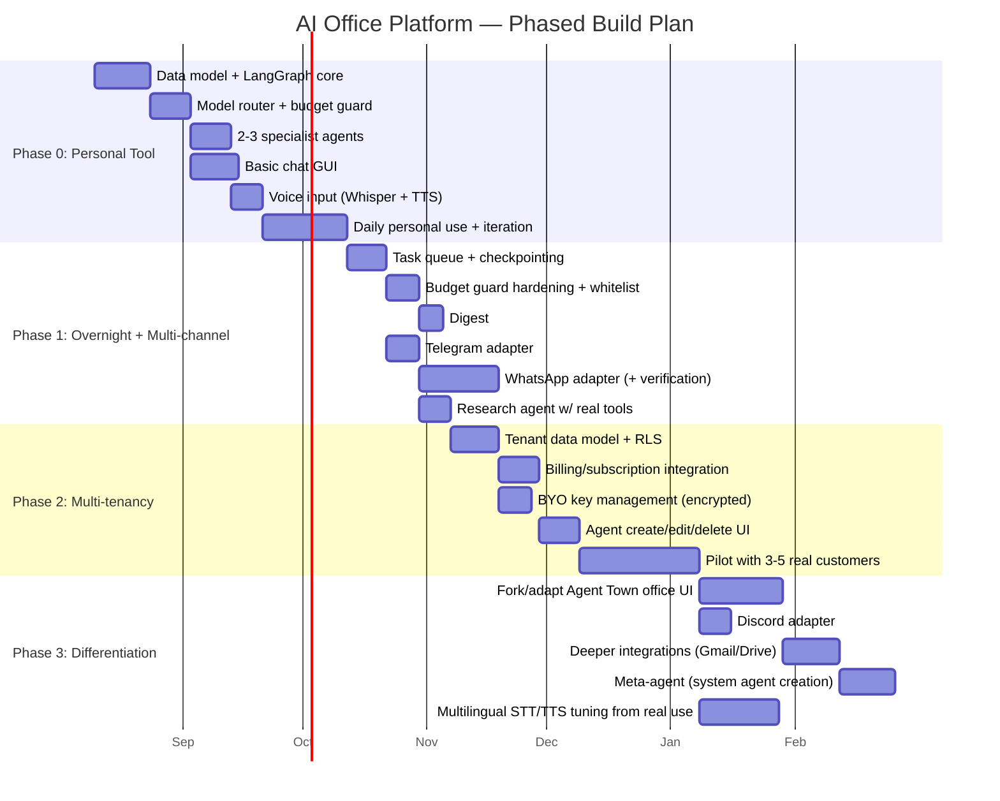

# Phased Development Plan

Part of the AI Employee Office Platform documentation set. See `00_INDEX.md` for the full document list.

This expands the phase summary from the main requirements doc into concrete, sequenced engineering work. Timeframes are illustrative (based on one senior full-stack+AI engineer working solo, part-time-to-full-time) — adjust to your real available hours.

---

## 1. Phase overview

---

## 2. Phase 0 — Personal tool (validate for yourself first)

**Goal:** you are using this daily on real client work before a single line of multi-tenant or sellable-product code is written.

| Task | Detail | Depends on |
|---|---|---|
| Postgres + pgvector schema | Implement the core tables from `04_database_design.md` (minus tenant/billing tables — those come in Phase 2) | — |
| LangGraph supervisor core | Office Manager agent, basic routing to 2-3 hardcoded specialist agents | Schema |
| Model router + budget guard | Classifier step, tier selection, hard per-task budget cap enforcement | Supervisor core |
| 2-3 working specialist agents | Pick based on your actual most-needed tasks (likely: writing/proofreading, research, coding) — do not build a full roster speculatively | Router |
| Basic chat GUI | Text input/output, task status view — skip the animated office entirely at this stage | Router |
| Voice input | Whisper STT + a TTS provider, starting with whatever language(s) you personally work in | Chat GUI functional |
| Daily use period | Use it yourself for at least 2-3 weeks of real work before moving on — this is where you'll discover which agents/features actually matter | All above |

**Exit criteria:** you genuinely prefer using this over doing the task yourself, for at least a few real recurring task types.

---

## 3. Phase 1 — Overnight autonomy + multi-channel

**Goal:** prove the two hardest technical promises — safe unattended execution, and "one backend, many faces" — before scaling to other customers.

| Task | Detail | Depends on |
|---|---|---|
| Task queue + checkpointing | Redis + BullMQ/Celery, LangGraph state persistence for resumable long tasks | Phase 0 core |
| Budget guard hardening | Per-tenant nightly aggregate cap (not just per-task), retry-then-escalate logic | Task queue |
| Action whitelist + approval gates | Implement `approvals` table and flow end-to-end | Budget guard |
| Digest | Consolidated "what happened since I last checked" report — not time-of-day-scoped; browsable history is just the same live query over an arbitrary past range, no scheduler | Approval gates |
| Telegram adapter | First proof of the multi-channel adapter pattern from `05_api_design.md` Section 6 | Core API stable |
| WhatsApp adapter | Higher priority for your target market, but factor in Business API verification lead time — start this early since it's a external dependency, not pure engineering time | Telegram adapter pattern proven |
| Research agent with real tools | Web search + fetch tools wired in, tested against real research tasks | Phase 0 agents |

**Exit criteria:** you can hand off a real project unattended and check back to a working Digest of what happened, with at least one messaging channel (Telegram or WhatsApp) fully functional alongside the chat GUI.

---

## 4. Phase 2 — Multi-tenancy & pricing

**Goal:** the product is sellable; onboard real paying pilot customers.

| Task | Detail | Depends on |
|---|---|---|
| Tenant data model + RLS | Full multi-tenant schema from `04_database_design.md`, RLS policies from `06_security_and_scalability.md` | Phase 1 stable |
| Billing/subscription integration | Stripe (or similar) wired to `subscriptions`/`usage_records`, tier enforcement per `02_cost_and_pricing.md` | Tenant model |
| BYO key management | Encrypted key storage, router logic to use tenant's own key when `billing_mode = 'byo'` | Tenant model |
| Agent create/edit/delete UI | User-facing version of what you've been doing via config/code in Phases 0-1 | Tenant model |
| Pilot with 3-5 real customers | Draw from your own network — agencies/freelancers first, per the target-customer table in the main requirements doc | All above |

**Exit criteria:** at least 3 paying (or committed pilot) customers actively using the platform, generating real usage data to validate the pricing model.

---

## 5. Phase 3 — Differentiation & scale

**Goal:** build the features that create real moat and retention, informed by actual pilot feedback rather than guesses.

| Task | Detail | Depends on |
|---|---|---|
| Animated office UI | Fork/adapt Agent Town's Phaser layer per the decision in `03_system_design.md` Section 12; wire to your backend via the adapter protocol | Phase 2 stable, adapter pattern proven |
| Discord adapter | Same pattern as Telegram/WhatsApp | Adapter pattern proven |
| Deeper integrations | Gmail, Drive, Slack, Notion, Facebook/Instagram — prioritize based on what pilot customers actually ask for | Phase 2 pilots underway |
| Meta-agent | System-assisted agent creation with human approval gate, per the main requirements doc Section 5.2 | Agent create/edit UI stable |
| Multilingual STT/TTS tuning | Use real usage data from pilot customers to pick/tune the final STT/TTS providers for whichever languages they actually use, rather than deciding from documentation alone | Pilots generating real multilingual usage |

**Exit criteria:** clear differentiation is visible in product usage (cost-transparency engagement, office UI engagement, multilingual voice adoption where relevant) and retention data.

---

## 6. Sequencing principles behind this plan

1. **Cost-control infrastructure (router, budget guard) comes before feature breadth** — matches your explicit top priority; building more agents on top of an unrouted, uncapped system just compounds the cost risk.
2. **The animated office UI is deliberately last**, not first, despite being the most visually exciting part — it's a differentiator and retention feature, not the thing that proves the core product works. Building it in Phase 0 would burn significant time before you know if the underlying agent system is even useful.
3. **Multi-tenancy is a Phase 2 concern, not Phase 0** — but the schema in `04_database_design.md` is designed multi-tenant from the start (every table has `tenant_id`) specifically so Phase 2 is "turn on enforcement" rather than "redesign the data model."
4. **WhatsApp verification lead time is flagged early** because it's an external dependency outside your control — starting the process in Phase 1 rather than Phase 3 avoids it becoming a late blocker.
5. **Every phase has a concrete exit criterion** tied to real usage/validation, not just "feature built" — this keeps the plan honest about whether to proceed to the next phase or spend more time validating the current one.
