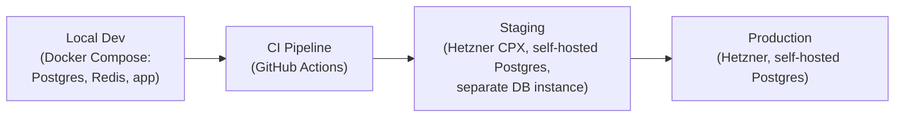
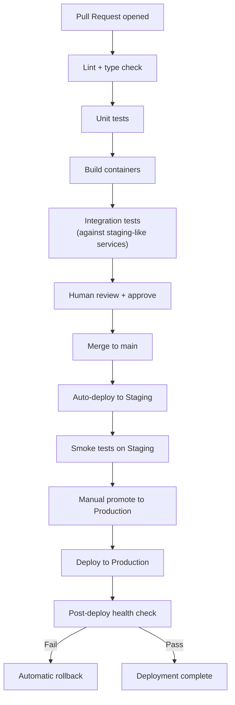
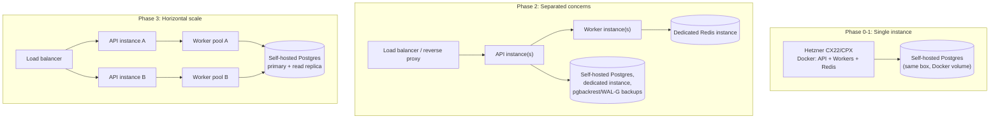

# DevOps & Deployment Guide

Part of the AI Employee Office Platform documentation set. See `00_INDEX.md` for the full document list.

---

## 1. Environment strategy



- **Local dev**: full stack runs via Docker Compose — Postgres+pgvector, Redis, the orchestration backend, and the frontend — so nothing requires cloud access to develop against. Use free/local model options (or a cheap model tier with a personal key) for iteration to avoid burning budget during development.
- **Staging**: a low-cost Hetzner instance mirroring production configuration but isolated data — used to validate deploys and run integration tests against real (but sandboxed) provider APIs before anything reaches customers.
- **Production**: starts on a single Hetzner instance (Phase 0/1) and scales per the stages in `06_security_and_scalability.md` Section 8.

---

## 2. CI/CD pipeline



- **GitHub Actions** (free for public/private repos at your scale) handles lint, test, build, and staging auto-deploy.
- **Production promotion is manual** at this stage — a deliberate choice: with real customer agents potentially running unattended overnight, you want a human decision point before any change reaches production, not full continuous deployment.
- **Automatic rollback** on failed post-deploy health checks (e.g., API not responding, DB migration failure) — critical since a broken deploy during someone's overnight autonomous run is exactly the trust-destroying failure mode to avoid.

---

## 3. Containerization

| Service | Container | Notes |
|---|---|---|
| Orchestration backend (LangGraph + API) | Python-based image | Keep this the smallest, most frequently deployed unit |
| Frontend (Next.js) | Node-based image, or deploy via Vercel/Netlify free-to-cheap tier instead of self-hosting | Vercel's free tier is genuinely sufficient for Phase 0/1 traffic — consider it over self-hosting the frontend to reduce ops burden |
| Task workers (specialist agent execution) | Separate Python image from the API — scales independently of request-serving traffic | Important: don't run long agent tasks in the same process handling HTTP requests |
| Sandboxed code execution | Isolated container per task-step, ephemeral, torn down after use | Per the security model in `06_security_and_scalability.md` Section 5 |

**Recommendation**: use **Docker Compose** for local dev and staging; for production, plain `docker run`/systemd-managed containers on a single Hetzner box is entirely sufficient through Phase 0-1 — **don't reach for Kubernetes** until you have a real multi-instance scaling need (likely not before mid-Phase 2). Kubernetes overhead on a solo-founder cost-conscious project works against the entire premise of this platform.

---

## 4. Deployment topology by phase



- **Reverse proxy**: Caddy or Nginx — Caddy is worth considering for its automatic HTTPS/Let's Encrypt handling, reducing ops overhead at small scale.
- **Load balancing** only becomes necessary once you run more than one API instance (Phase 2+) — a single well-sized Hetzner instance handles substantial concurrent load before this is needed.
- **Postgres stays self-hosted at every phase** — it moves onto its own dedicated instance for isolation/performance reasons as load grows, never onto a managed-database vendor. See Section 9 below for the concrete self-hosted setup.

---

## 5. Secrets & configuration management

- **Phase 0/1**: environment variables injected via `.env` (local) and the hosting provider's environment variable settings (Hetzner via your deploy tooling, or Vercel's environment variable UI for the frontend). Never commit secrets to the repo — enforce with a pre-commit secret-scanning hook (e.g., `gitleaks`, free and open source).
- **Phase 2+**: move to a dedicated secrets manager (Infisical — open source, self-hostable, free tier — or Doppler) once multiple environments and team members need coordinated secret access.
- **Per-tenant BYO API keys** are application data, not deployment secrets — they live encrypted in Postgres per `04_database_design.md`/`06_security_and_scalability.md`, not in environment configuration.

---

## 6. Observability stack (cost-conscious choices)

| Concern | Tool | Cost |
|---|---|---|
| Application logs | Self-hosted (Docker logs + a lightweight aggregator like Vector) initially; Grafana Loki free self-hosted tier as volume grows | $0, compute cost only |
| Metrics/dashboards | Grafana (self-hosted, open source) or Grafana Cloud free tier | $0 at Phase 0-1 volumes |
| Error tracking | Sentry free tier (generous for solo/small projects) | $0 initially |
| Uptime monitoring | UptimeRobot free tier, or a simple self-written healthcheck cron | $0 |
| Per-tenant cost/usage dashboard | Custom-built against `usage_records` — this is product functionality, not just ops tooling, so it's part of the app itself, not a third-party observability tool | Built as part of the product |

This stack costs effectively **$0 in tooling** through Phase 0-1, scaling to paid tiers of the same tools (Grafana Cloud, Sentry Team) only once real usage volume and team size justify it.

---

## 7. Backup & disaster recovery

- **Postgres**: continuous backup via `pgBackRest` or `WAL-G` (see Section 9 below for current tooling status and recommendation) streaming to object storage (self-hosted MinIO or R2) — verify retention period matches your risk tolerance; supplement with periodic `pg_dump` logical exports as an independent, format-portable backup.
- **Object storage (R2)**: enable versioning on the bucket if budget allows, so accidental artifact deletion/overwrite is recoverable.
- **Redis**: task queue state is semi-ephemeral by design (checkpointed task state lives in Postgres per `03_system_design.md` Section 7), so Redis itself doesn't need heavy backup investment — a queue rebuild from Postgres checkpoint state on Redis loss is an acceptable recovery path at this scale.
- **Recovery drill**: once real customers are on the platform (Phase 2), run at least one actual restore-from-backup drill — don't assume backups work until you've proven a restore.

---

## 9. Self-hosted Postgres — no managed-database vendor

This section replaces any reliance on a managed database provider (e.g., Supabase, RDS, Neon) with a fully self-hosted setup, per your explicit requirement to avoid vendor lock-in. The tradeoff is honest: you take on backup/auth/upgrade responsibility yourself, in exchange for zero platform dependency and full control of your data. Given the scale this system runs at through Phase 2 (dozens of tenants), this is very manageable for one engineer.

### 9.1 Running Postgres

- **Phase 0/1**: Postgres + pgvector runs as a Docker container alongside the app on the same Hetzner instance, with the data directory on a persistent volume. The official `pgvector/pgvector` Docker image (built on top of the standard Postgres image) is the simplest starting point — no separate extension install step needed.
- **Phase 2+**: Postgres moves to its own dedicated Hetzner instance, separate from the app/worker servers, so database I/O and application load don't compete for the same resources. Still self-hosted — just a second box under your control, not a managed vendor.
- **Connection pooling**: introduce **PgBouncer** (open source) once concurrent connections grow — Postgres itself has a real per-connection cost, and a pooler is the standard fix long before you'd need read replicas.

### 9.2 Backup tooling — current status and recommendation

The self-hosted Postgres backup landscape had real turbulence in 2026 worth knowing about before you commit:

- <cite index="103-1">pgBackRest — long the de facto standard — was archived on April 27, 2026 after its maintainer lost corporate sponsorship following the Crunchy Data sale, but was revived within two weeks by a coalition of sponsors, with a competing fork (pgxbackup) also emerging from the same event.</cite> It's usable again, but this history is worth knowing: the tool went through a real continuity scare, and there are now two trees (the revived original and the fork) to be aware of.
- <cite index="96-1">WAL-G is the other major option — an archival/restoration tool built for performance with parallel compression and encryption, and its multi-database support means it follows you if your stack ever grows beyond just Postgres.</cite> <cite index="103-1">It's actively maintained, written in Go, and supports delta backups with parallel processing.</cite>

**Recommendation**: use **WAL-G** as the primary continuous-backup tool, specifically because it didn't go through pgBackRest's 2026 maintenance scare and has a simpler operational model for a solo-engineer setup. Supplement with periodic `pg_dump` logical backups (built into Postgres itself, zero extra dependency) as a second, format-portable safety net — a logical dump is slower to restore at scale but is the simplest possible "worst case" recovery path and never depends on any third-party tool's continued maintenance.

```
Continuous backups:  WAL-G  -> streams WAL archives to object storage (MinIO/R2)
Point-in-time safety net:  Nightly pg_dump  -> separate storage location
Recovery drill:  Quarterly, restore both paths to a scratch instance and verify
```

### 9.3 Self-hosted auth (replacing Supabase Auth)

Since managed auth is being dropped alongside managed Postgres, standard JWT session auth needs a concrete implementation path:

- **Recommended**: a lightweight, open-source auth library appropriate to your backend language (e.g., if the orchestration backend is Python/LangGraph-based per `03_system_design.md`, a library like `Authlib` or a minimal custom JWT-issuing service; if the API gateway layer is Node-based, `Lucia` or a similar minimal session library) — the auth requirement here (email/password or OAuth login, JWT issuance with `tenant_id` claim) is not complex enough to justify a heavier identity platform.
- Store password hashes with a strong modern algorithm (e.g., `argon2`), never anything weaker — this is a baseline regardless of self-hosting.
- OAuth (e.g., "Sign in with Google") can be implemented directly against each provider's standard OAuth endpoints without needing a third-party auth-as-a-service layer.

### 9.4 What you gain and what you own, stated plainly

| | Managed vendor (e.g., Supabase) | Self-hosted (this recommendation) |
|---|---|---|
| Vendor lock-in risk | Low-but-nonzero (Auth/Storage/Edge Functions are vendor-specific even though core Postgres isn't) | None — you hold the actual database files and backups |
| Ops burden | Low (vendor handles backups, upgrades, scaling) | You own backup verification, security patching, and scaling decisions |
| Cost at small scale | ~$0-25/mo | ~$0/mo beyond the VPS you already need |
| Data residency control | Vendor's supported regions | Exactly wherever you deploy |
| Recovery drill responsibility | Largely the vendor's | Yours — Section 7's recovery drill requirement is non-negotiable specifically because of this |

This tradeoff is a deliberate, informed choice given your stated priorities — not a default. Revisit it only if ops burden genuinely becomes a bottleneck on your own time at meaningfully larger scale, not preemptively.

---

## 10. Deployment checklist (use for every production release)

- [ ] All tests passing in CI
- [ ] Staging smoke test passed
- [ ] Database migrations reviewed (no destructive changes without a rollback plan)
- [ ] Budget guard and approval-gate logic specifically re-tested if touched — this is the highest-consequence code path in the system
- [ ] Secrets/config diff reviewed (no accidental plaintext secret in a config file)
- [ ] Rollback plan confirmed (previous container image tag noted, ready to redeploy)
- [ ] If deploying during a window when tenants may have active overnight tasks running, confirm in-flight tasks will checkpoint safely through the deploy, not silently drop
- [ ] If this release touches the Postgres backup/restore path, run a scratch-instance restore test before considering it done (per Section 9.2)
