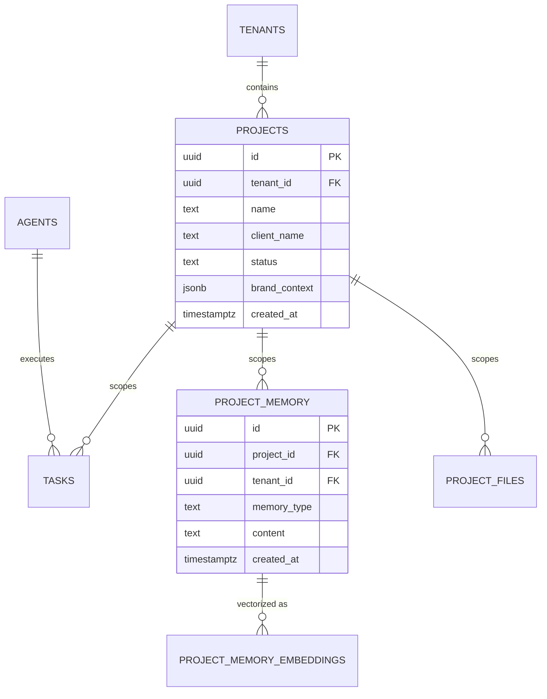
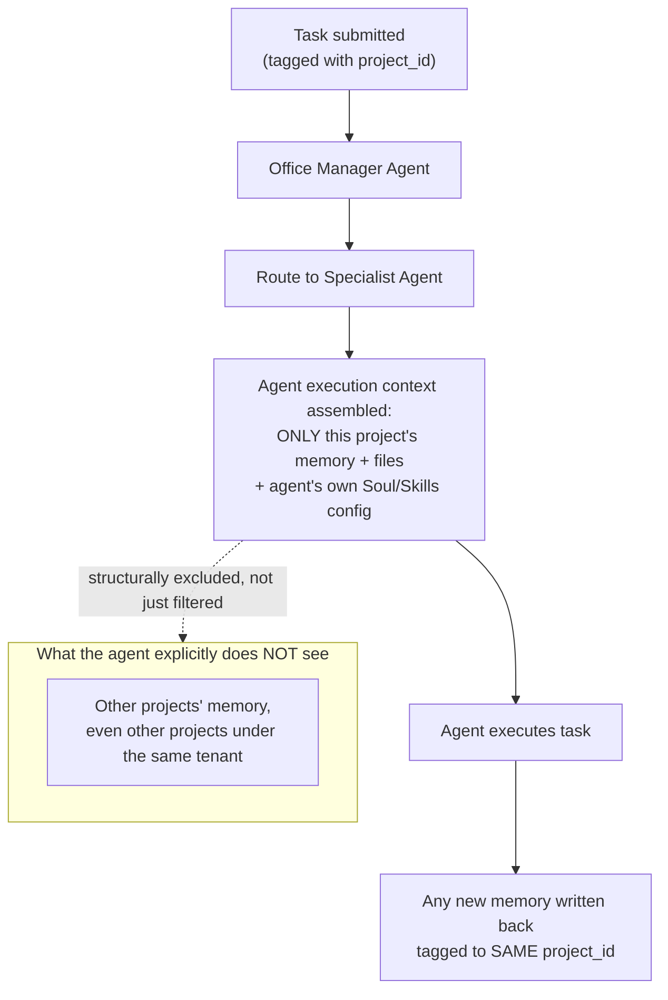
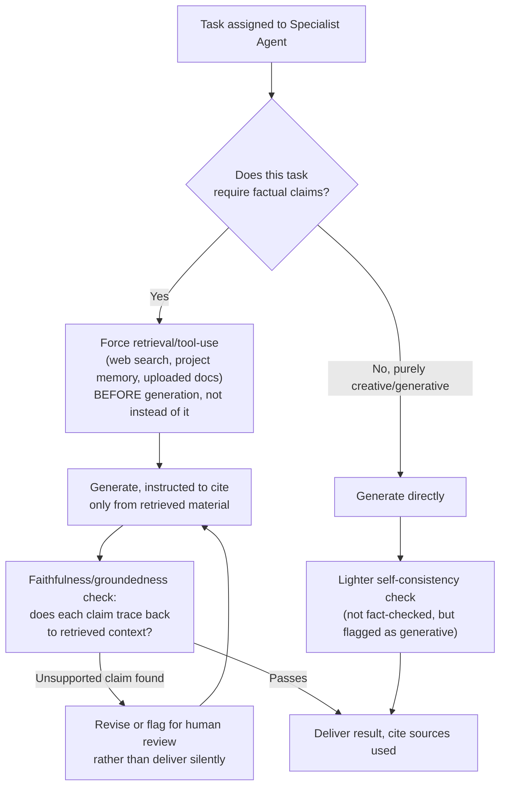
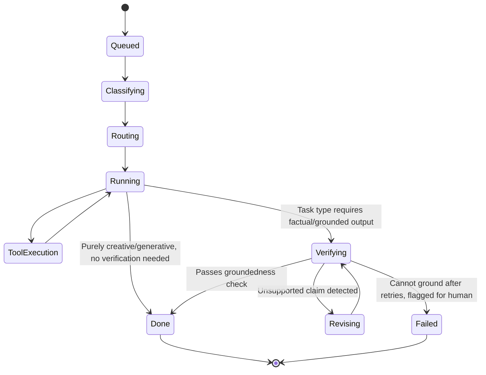
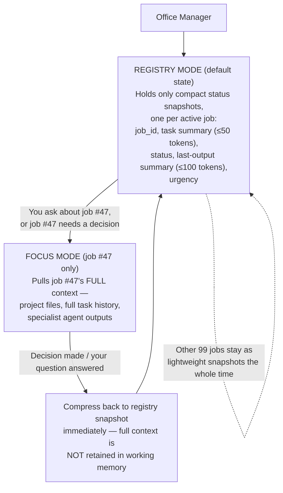
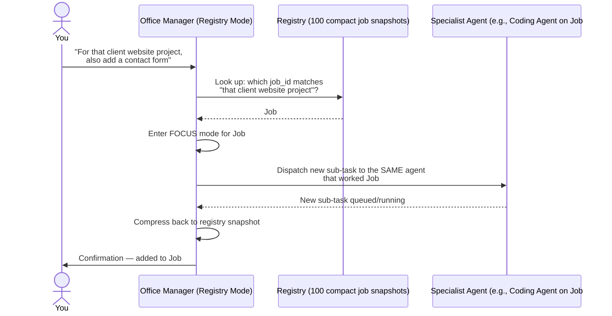
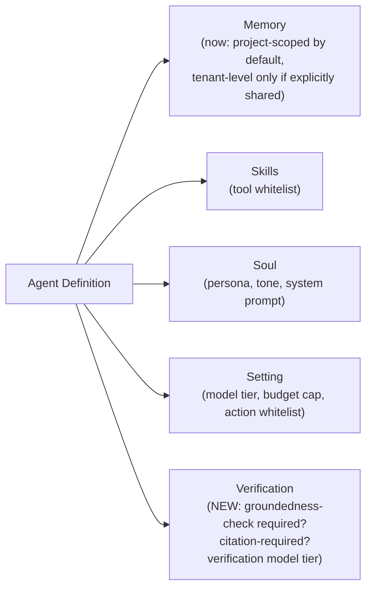

# Hallucination Prevention, Cross-Project Context Isolation & Coordinator Scaling

Part of the AI Employee Office Platform documentation set. See `00_INDEX.md` for the full document list.

---

## 1. Why this is a separate document, and what it actually answers

You asked three related but distinct questions, across two separate messages:

1. **Agents should not hallucinate.**
2. **If I give the master agent two different clients' projects, those must not mix data or context with each other.**
3. **The master agent is like an office boss operating others — even given 100 simultaneous different jobs, it must not hallucinate or mix them up, but if you later ask it to extend a job you gave it earlier, it should correctly route that back to the right agent.**

**Honest answer: none of these were fully covered in the existing doc set before this document.** Here's precisely what we had and what was missing:

| Concern | Did we already have this? |
|---|---|
| Tenant A's data never visible to Tenant B | **Yes** — Row-Level Security in `04_database_design.md` / `06_security_and_scalability.md` solves this |
| Client Project 1 and Client Project 2, both under *your own* tenant account, never bleeding into each other | **No** — the schema had no `project`/`client` concept at all, only `tenant_id`. Part A of this document closes that gap. |
| Agents grounding claims in real data instead of fabricating | **No** — nothing in the doc set addressed hallucination mechanics before this document. Part B closes that gap. |
| Verifying an agent's output before it's trusted/delivered | **No** — task execution had no verification/judge step. Part B closes that gap. |
| The Office Manager itself scaling to many (e.g., 100) simultaneous jobs without blending their details | **No** — this is a distinct failure mode from cross-project contamination between *specialist* agents; nothing addressed the coordinator's own working-memory design. Part C closes that gap. |
| Correctly resuming/extending a specific previously-assigned job when you reference it later | **No** — required a durable lookup mechanism that didn't exist yet. Part C closes that gap. |

This document adds three things: a **context isolation model** (Part A, so client projects never contaminate each other), a **hallucination mitigation pipeline** (Part B, so agents ground claims in real data and get checked before delivery), and a **coordinator scaling model** (Part C, so the Office Manager itself stays accurate and cheap under many simultaneous jobs, using a registry/focus-session pattern). All three plug into the existing architecture in `03_system_design.md` without requiring a redesign.

---

## 2. Part A — Cross-project context isolation

### 2.1 The actual failure mode, named precisely

This is a documented, studied problem in multi-agent systems research, distinct from tenant-level security. It's called **context pollution** or **context contamination**: when multiple tasks/agents share an orchestrator's context window or memory store without hard boundaries, one task's state leaks into another's reasoning — not through a security hole, but simply because nothing stopped the model from seeing both at once. Recent research quantifies this precisely: <cite index="64-1">in multi-agent LLM orchestration, when multiple concurrent agents compete for the orchestrator's context window, each agent's task state, partial outputs, and pending questions contaminate the steering interactions of every other agent, degrading decision quality — a flat-context baseline (no isolation) showed wrong-agent contamination rates of 28-57%, while an isolated-context design brought that down to 0-14%.</cite>

This is exactly your two-clients scenario: if your Office Manager agent holds Client A's brand guidelines and Client B's project brief in the *same* context window or the *same* retrieved-memory pool while working, the model can genuinely conflate them — mention Client A's product in Client B's copy, apply the wrong brand voice, or reference the wrong contract terms. This isn't a hypothetical edge case; it's the default failure mode of naive multi-agent memory design.

### 2.2 The fix: a `project` (workspace) layer between tenant and task

The current schema (`04_database_design.md`) scopes everything by `tenant_id` only. We add a **`projects`** table beneath tenant and above task/memory, and make it the hard isolation boundary for context — not just an organizational label.



**The critical rule this enforces: retrieval is always scoped to `project_id`, never just `tenant_id`.** An agent working on Client B's task never even *queries* Client A's project memory — it's not filtered out after retrieval, it's structurally unreachable from that execution context. This mirrors the same principle already used for tenant isolation in `06_security_and_scalability.md` Section 2, just one level deeper.

### 2.3 How this changes agent execution



- **Every task carries a `project_id`**, not just a `tenant_id`. The main requirements doc's task-submission flow and the `tasks` table in `04_database_design.md` need this field added (see Section 2.5 below for the concrete schema change).
- **The Office Manager agent itself is project-scoped per task.** When you say "here's Client A's project," that becomes the active `project_id` for the whole task tree it spawns — every specialist agent it delegates to inherits that same scope, and none of them can query outside it.
- **This mirrors a pattern already proven in production coding-agent systems**: <cite index="66-1">each subagent operates with an isolated context window, receiving only the information relevant to its task plus persistent project context — not the entire dialogue history or unrelated data — which is an intentional design to prevent cross-contamination between different phases of the workflow, while common background information all agents should know is provided via a separate persistent context file preloaded into each agent's context.</cite> We apply the same idea, but the "unrelated data" boundary is drawn at the **project** level, not just the workflow-phase level.

### 2.4 Handling genuinely shared context (without breaking isolation)

Not everything should be project-walled — e.g., your own general writing style preferences, or tenant-wide brand voice defaults, might legitimately apply across projects. The fix is an explicit **two-tier memory model**, not a single pool:

| Memory tier | Scope | Example |
|---|---|---|
| Tenant-level memory | Shared across all of your projects, explicitly opted-in | "I always want a formal tone in client emails" |
| Project-level memory | Hard-isolated to one client/project | "Client A's brand colors are X, Client B's product launches in March" |

An agent's context assembly step always pulls **tenant-level memory (if relevant) + the one active project's memory**, never another project's memory — the tenant tier is the *only* legitimate cross-project channel, and it's populated by explicit user action, never by an agent auto-promoting something it learned on one project into the shared tier.

### 2.5 Concrete schema change required

This updates `04_database_design.md`:

```sql
-- New table
CREATE TABLE projects (
    id UUID PRIMARY KEY DEFAULT gen_random_uuid(),
    tenant_id UUID NOT NULL REFERENCES tenants(id),
    name TEXT NOT NULL,
    client_name TEXT,
    status TEXT NOT NULL DEFAULT 'active',
    brand_context JSONB,
    created_at TIMESTAMPTZ NOT NULL DEFAULT now()
);

-- Add project scoping to existing tables
ALTER TABLE tasks ADD COLUMN project_id UUID REFERENCES projects(id);
ALTER TABLE agent_memory ADD COLUMN project_id UUID REFERENCES projects(id);
-- project_id is nullable on agent_memory specifically to allow the
-- tenant-level (cross-project) memory tier described in 2.4 above;
-- NULL = tenant-level, set = project-scoped

-- RLS addition (in addition to existing tenant_id policy)
CREATE POLICY project_isolation ON tasks
    USING (
        project_id IS NULL
        OR project_id = current_setting('app.current_project_id')::uuid
    );
```

- **`agents` themselves stay tenant-scoped, not project-scoped** — the same Coding Agent or Writing Agent you configured can work across multiple client projects, since the agent's *config* (Soul/Skills/Setting) is reusable. It's the *memory and task context* that gets project-walled, not the agent identity. This is what lets you have one roster of "employees" who each work on multiple clients responsibly, mirroring how a real employee at an agency would.

---

## 3. Part B — Hallucination prevention

### 3.1 Naming the actual problem precisely

Treating "hallucination" as one bug is itself a mistake — <cite index="58-1">hallucination actually takes four distinct shapes: factual, grounding, citation, and reasoning hallucination, and a single rubric that averages all four into one number tells you nothing about which one to fix; the mitigation is different for each.</cite> For your agent office, the practical breakdown is:

| Type | What it looks like in your system | Primary mitigation |
|---|---|---|
| **Factual** | Agent states something false about a general topic (e.g., a wrong statistic in a research task) | Retrieval/tool-use upstream of generation — force the agent to look things up rather than recall from memory |
| **Grounding** | Agent's claim isn't actually supported by the client's own documents/brand guidelines it was given | Per-claim groundedness checking against the retrieved project context |
| **Citation** | Agent cites a source that doesn't say what it claims (or doesn't exist) | Structured citation enforcement + verification against the actual source |
| **Reasoning** | Agent's multi-step plan has a broken logical link (e.g., a coding agent's fix doesn't address the actual bug) | Per-step trace review, not just end-result review |

### 3.2 The mitigation pipeline, mapped onto your existing architecture



This is not a new architectural layer bolted on — it slots directly into the existing task lifecycle from `03_system_design.md` Section 4, as an additional state between `Running` and `Done`:



### 3.3 Concrete mechanisms, mapped to what's cheap vs. what's worth paying for

Given your top priority is cost control, not every task needs the heaviest verification — this should itself be **router-driven**, same principle as model-tier routing:

| Mechanism | What it does | Cost | When to use it |
|---|---|---|---|
| **Mandatory retrieval before generation** | Agent must query project memory/web search/uploaded docs before making factual claims, not answer from parametric memory alone | Low (same cost as the search/fetch tool calls you're already paying for) | Any task touching client-specific facts (brand details, project specs, prior decisions) — always on |
| **Structured output + citation requirement** | Force the model to tag which claims come from which retrieved source, in the output schema itself | Near-zero (prompt/schema design, no extra model call) | Any research, factual writing, or client-communication task |
| **Claim-level groundedness check** | A cheap-tier model call that checks: "does each claim in this draft trace back to the retrieved context?" — <cite index="57-1">enforcing must-cite rules for knowledge-intensive claims and blocking outputs without supporting evidence for high-stakes queries</cite> | Low — one cheap-tier verification call per task, not a frontier-tier call | Client-facing deliverables, anything going out under the client's name, financial/contractual content |
| **Self-consistency / best-of-N sampling** | Generate a few candidate answers, check agreement, pick the most consistent — <cite index="59-1">evaluating multiple candidate responses with a lightweight factuality metric and choosing the most faithful one significantly lowers error rates without retraining the model</cite> | Moderate (multiple generations) | Reserve for high-stakes tasks only (e.g., a legal-adjacent claim, a number going into a client invoice) — too expensive to run on every task given your cost-first priority |
| **Human approval gate** | The existing `approvals` mechanism from `06_security_and_scalability.md` Section 4 | Zero marginal LLM cost | Anything irreversible or client-facing — this is your cheapest, highest-value safety net and should remain the default for external-facing output regardless of how good the automated checks are |

**Recommendation matching your stated cost priority:** make retrieval-before-generation and citation-tagging the "always on, cheap" baseline for every task; reserve the claim-level groundedness judge for tasks flagged as client-facing or factual (the same classifier that does model-tier routing can also flag this); and lean on the existing human-approval gate as the final backstop rather than trying to make automated verification perfect — that's both cheaper and more honest about current LLM verification limits.

### 3.4 What this looks like in the `task_steps` audit trail

Extends the existing schema from `04_database_design.md` Section 2.5 — no new table needed, just a documented convention for how verification steps are logged:

```json
{
  "step_type": "groundedness_check",
  "status": "passed",
  "details": {
    "claims_checked": 6,
    "claims_unsupported": 0,
    "sources_used": ["project_memory:brand_guidelines", "web_search:3 results"]
  },
  "cost_usd": 0.0009
}
```

This makes hallucination-checking itself visible in the same audit trail/activity feed described in `10_ui_ux_guide.md` Section 13 — a client-facing task's detail view can show "✓ Grounded — 6/6 claims verified against your project files," which is also a genuine trust/sales differentiator, not just an internal safeguard.

---

## 4. Part C — The Office Manager under load: 100 simultaneous jobs without cross-contamination

You described the Office Manager precisely: "just like me, an office boss, he will just operate others" — a coordinator, not a doer. This part addresses a failure mode distinct from both Part A (cross-project contamination between specialist agents) and Part B (hallucinated claims): **the coordinator itself blending details from job #47 into job #83 because it's holding too much at once.** This is a real, named, researched problem, not a hypothetical — worth taking exactly as seriously as the other two.

### 4.1 Why this is a different failure mode from Parts A and B

Part A solved contamination *between specialist agents* working different projects. This is about **the Office Manager's own working memory** as it juggles many jobs simultaneously — even with perfect project isolation downstream, the coordinator itself can still be the leak point if it's naively holding full context for every active job at once.

The research is direct on why this happens: <cite index="126-1">the orchestrator accumulates context from every worker it's coordinating, and context window overflow is a subtle, real problem — at scale, a workflow that cost $0.50 in testing can hit $50,000/month at high volume, because the orchestrator makes multiple LLM calls for decomposition and aggregation on top of every worker call.</cite> <cite index="129-1">The orchestrator becomes both a context window bottleneck (holding the full task description, all worker results, and enough context to synthesize a final response) and a throughput bottleneck — for tasks producing many intermediate results, this can exceed context window limits even on very large models.</cite> At 100 simultaneous jobs, a naive "keep everything in one context" design doesn't just risk hallucination — it becomes mathematically unworkable regardless of model quality.

### 4.2 The fix: Registry / Focus-session pattern, applied to the Office Manager specifically

This is the same DACS pattern referenced in Part A (Section 2.1), now applied as the Office Manager's own operating discipline, not just a rule for specialist agents:



<cite index="123-1">Concretely: the orchestrator holds a registry — a set of compact status snapshots, one per active job, each capped around 200 tokens (task description ≤50 tokens, last-output summary ≤100 tokens, status, urgency) — and only enters a "focus" session, pulling in a specific job's full context, when actively steering that one job; for a registry of 10 concurrent items this totals under 2,000 tokens, leaving ample room for the one job actually in focus.</cite> At 100 jobs instead of 10, the registry scales linearly and stays cheap (roughly 20,000 tokens for 100 compact snapshots — well within normal context budgets), while full job context is only ever loaded one job at a time, exactly when needed.

**This is what makes "100 simultaneous jobs, no hallucination" actually true rather than aspirational**: the Office Manager is never holding job #47's client details and job #83's client details in the same working context simultaneously, by construction — not because it's been told not to confuse them, but because it structurally can't see both at once outside of the moment it's deliberately focused on one.

### 4.3 Answering your specific follow-up case: resuming work on a previously-assigned job

You asked specifically: if you later ask the Office Manager to do something more on a job you gave it earlier, it should correctly route that back to the right specialist agent — not lose track, not confuse it with a different job. This is exactly what the registry is for:



The mechanism that makes this reliable is the same `project_id` scoping from Part A — every job has a durable identity (`project_id` + `task` lineage) that the registry can look up by, so "that client website project" resolves to a specific, unambiguous job rather than the Office Manager guessing from a blended memory of everything it's ever worked on. **The registry is a lookup structure, not a fuzzy recollection** — this is the concrete difference between "an office boss who remembers things properly" and "an office boss who might mix up two clients."

### 4.4 Schema and architecture additions

Extends `04_database_design.md` and `03_system_design.md`:

```sql
-- The registry is a live, queryable view — not a new table, but a defined query pattern
-- against the existing tasks table, kept intentionally cheap:
CREATE VIEW office_manager_registry AS
SELECT
    id AS job_id,
    project_id,
    LEFT(input_text, 50) AS task_summary,   -- capped, per the ≤50 token guidance
    status,
    LEFT(metadata->>'last_output_summary', 100) AS last_output_summary,
    metadata->>'urgency' AS urgency
FROM tasks
WHERE status IN ('queued', 'running', 'awaiting_approval');
```

- **The Office Manager's default operating context, at any moment, is this registry view — never a raw join across all active jobs' full task_steps.** Full context (the "Focus" pull) is a deliberate, explicit query scoped to one `job_id`/`project_id`, triggered only when you reference that specific job or when it needs a decision.
- **This is also a cost optimization, not just an accuracy one** — per `13_byo_provider_architecture.md`'s cost-minimization principles, keeping the Office Manager's default context small and cheap directly reduces the token cost of every coordination step, which matters enormously at 100-concurrent-job scale where the coordinator itself is making many calls.

---

## 5. Updated agent configuration model

This extends the Memory/Skills/Soul/Setting model from `03_system_design.md` Section 10 with one more required field:



Every agent config now has an explicit **Verification** setting — e.g., a Coding Agent might set `groundedness_check: false` (code correctness is checked by running tests, not a factuality judge) while a Research Agent or client-facing Writing Agent sets `groundedness_check: true, citation_required: true`. This is configured per-agent, not globally, because "does this task type even have a factual-grounding concept" varies by specialist.

---

## 6. What this does and does not guarantee

Being precise here matters more than sounding reassuring:

- **This significantly reduces both cross-project contamination and ungrounded claims — it does not make either mathematically impossible.** <cite index="60-1">Pairwise consistency checks don't guarantee global coherence, and even well-curated retrieval pipelines can fabricate citations</cite> — no verification layer available today is a perfect guarantee, which is exactly why the human-approval gate remains the final backstop for anything externally consequential, not a redundant afterthought.
- **The project-isolation boundary is structural (the agent literally cannot query outside its scope), which is a stronger guarantee than the hallucination-verification layer (which is probabilistic, catching most but not all unsupported claims).** Communicate this distinction honestly to customers: "your clients' data never mixes" is a claim you can back with architecture; "our agents never make mistakes" is not a claim any LLM system can honestly make in 2026, and shouldn't be marketed as one.
- **The registry/focus pattern (Part C) is also structural, not probabilistic** — the Office Manager's default context genuinely does not contain other jobs' full details, by construction, the same category of guarantee as project isolation. What remains probabilistic is the *lookup* step ("which job_id does 'that client website project' refer to?") — a well-scoped registry query against durable `project_id`/task lineage is reliable, but an ambiguous reference from you (e.g., two jobs that are genuinely hard to distinguish from your own phrasing) can still occasionally need a clarifying question rather than a guess. That's a reasonable, honest tradeoff, not a hidden gap.
- **This is also a real, defensible sales differentiator once built**, precisely because it's honest: showing a customer "here's exactly which of your project files this claim came from" is a stronger trust signal than a vague "powered by AI" promise, and directly extends the cost-transparency brand positioning from `09_brand_identity.md` into an accuracy-transparency stance too.
