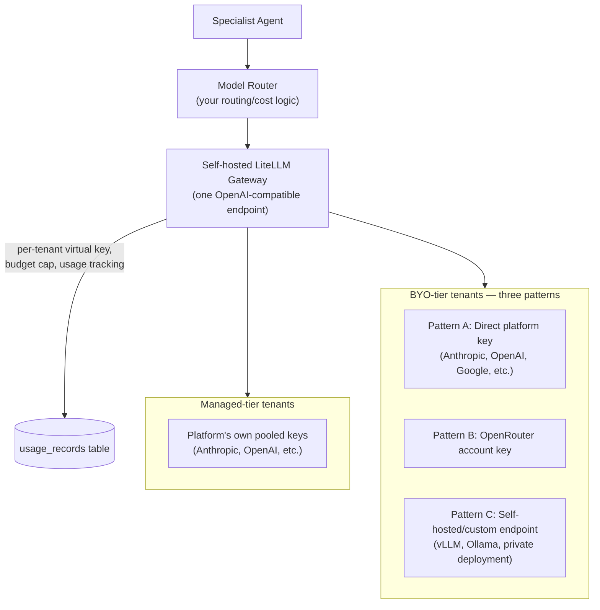
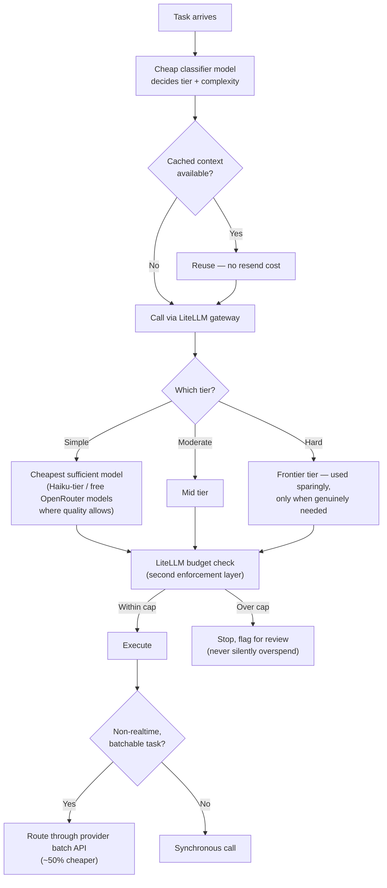

# BYO Model Provider Architecture & Ultra-Low-Cost Execution

Part of the AI Employee Office Platform documentation set. See `00_INDEX.md` for the full document list.

This document does two things: (1) properly designs BYO-API to cover the three real patterns customers will actually bring — OpenRouter accounts, self-hosted/custom-endpoint LLMs, and direct platform keys (Anthropic, OpenAI, etc.) — and (2) makes cheap agentic task execution a first-class architectural property, not just a routing policy.

---

## 1. Why the original BYO design was too thin

The main requirements doc treated BYO as roughly "customer supplies an Anthropic or OpenAI key." That's only one of at least three real patterns your customers will bring:

| Pattern | What the customer has | What this requires from us |
|---|---|---|
| **Direct platform key** | An Anthropic API key, an OpenAI API key, a Google AI key, etc. | Provider-specific API integration, one per platform |
| **OpenRouter account** | A single OpenRouter API key giving access to 300+ models across providers | A different integration — OpenRouter's own API shape, not each underlying provider's |
| **Self-hosted / custom-endpoint LLM** | Their own hosted model (e.g., a self-hosted vLLM/Ollama instance, a private company deployment, a fine-tuned model behind their own endpoint) | An arbitrary OpenAI-compatible (or custom) endpoint URL + key, not a fixed provider list at all |

These three cases have genuinely different validation, routing, and error-handling needs — treating them as one "BYO key" field would break the moment a real customer shows up with the second or third pattern. This document fixes that.

---

## 0. Phased rollout (added 2026-08-25, updated 2026-08-25) — this document describes the Phase 2+ target architecture; Phase 0/1 runs a lighter first increment of the same idea

Everything below describes the full self-hosted-gateway architecture for when there are real BYO/multi-tenant customers to serve — a separate LiteLLM *server* process, per-tenant virtual keys, and enforced multi-tenant budgets. **Phase 0/1 (single-tenant personal use) does not stand up that server.** Instead, `model_router.py`/`llm_client.py` implement a small **in-app provider registry** (Phase 1.8, `phase_by_phase_development_plan.md`) — the same conceptual shape as Patterns A/B/C below (multiple provider backends behind one router, chosen automatically by cost or pinned manually), just running as code inside the existing FastAPI service instead of a separate proxy. It starts with **DeepInfra** and **OpenRouter** as registered providers (both already give one account/one bill across the models Phase 0/1 needs — DeepSeek-class for cheap tiers, Claude for frontier) and is designed to grow by adding registry entries — **AWS Bedrock, a direct Anthropic key, a direct OpenAI key** — without an architecture change, matching this document's Pattern A (direct key) and Pattern B (OpenRouter) shapes one tenant early.

**Why not the full gateway yet:** the multi-tenant virtual-key, per-tenant budget-cap, and cross-BYO-pattern enforcement described below don't apply with one tenant — running a separate LiteLLM instance now would be infrastructure to operate for no benefit over the in-app registry.

**Self-hosted LiteLLM is introduced at Phase 2.3** (`phase_by_phase_development_plan.md`), when Pattern A/B/C BYO routing and per-tenant enforcement in Section 2 below become real requirements. Because Phase 1.8's provider registry already mirrors this document's shape, that migration is an upgrade of an existing pattern (swap the in-app registry for LiteLLM's proxy, keep the same provider concepts), not a rewrite. Until Phase 2.3, treat this document as the design to build *toward* for multi-tenancy specifically — single-tenant provider flexibility already exists via Phase 1.8.

---

## 2. The fix: adopt a self-hosted LLM gateway as the abstraction layer

Rather than hand-building three separate integration paths, the right move is to put a **self-hosted, open-source LLM gateway** between your orchestration backend and every model call — for both managed and BYO tenants. **LiteLLM** is the concrete recommendation: <cite index="117-1">it's open source, puts your full AI stack behind one OpenAI-compatible key, tracks and caps spend, routes to the right model, and self-hosts anywhere — even air-gapped — supporting 140+ providers and over a thousand models.</cite> Critically, <cite index="120-1">the proxy exposes budgets and rate limits per virtual key/user with built-in access control, and</cite> <cite name="118-1">it's a self-hosted OpenAI-compatible gateway that any existing OpenAI-format client can call with zero code changes.</cite>

This directly solves your no-vendor-lock-in requirement too: **LiteLLM itself is self-hosted, so you're not trading a Supabase-style lock-in for an OpenRouter-style one.** It becomes infrastructure you run and own, not a vendor you depend on.



- **The Model Router (your own routing/cost logic from `03_system_design.md`) stays exactly as designed** — it decides *which model tier* a task needs. What changes is that instead of calling providers directly or calling OpenRouter directly, it calls **your own LiteLLM instance**, which then handles the actual provider-specific dispatch.
- **LiteLLM's virtual keys map directly onto your `api_keys` table** (`04_database_design.md` Section 2.9) — each tenant gets a LiteLLM virtual key configured to point at whichever underlying pattern (A, B, or C) they've supplied, with LiteLLM enforcing the per-tenant budget cap natively as a second layer beneath your own Budget Guard.

---

## 3. Handling each BYO pattern concretely

### 3.1 Pattern A — Direct platform key (Anthropic, OpenAI, Google, etc.)

- Customer enters their API key for a specific provider in the Settings > API Keys page (`10_ui_ux_guide.md` Section 16).
- Stored encrypted (per `06_security_and_scalability.md` Section 3), registered as a named provider credential in LiteLLM's config for that tenant's virtual key.
- LiteLLM validates the key on entry (a lightweight test call) so the UI can show "✓ Valid" or "✗ Invalid" immediately, rather than the customer discovering a bad key mid-task.

### 3.2 Pattern B — OpenRouter account

- Customer enters their own OpenRouter API key instead of a platform-specific one.
- <cite index="108-1">OpenRouter's BYOK (bring-your-own-key) support means the first 1 million BYOK requests each month are free on standard plans, and provider token rates pass through without an additional markup from OpenRouter itself</cite> — meaning a customer using their own OpenRouter account through your platform pays close to raw provider rates, which is a genuinely attractive value proposition to surface to technical customers.
- LiteLLM treats OpenRouter as just another provider in its config — <cite index="119-1">since LiteLLM already normalizes 100+ providers behind one interface, OpenRouter is simply one more entry, not a special case requiring separate integration code.</cite>

### 3.3 Pattern C — Self-hosted / custom-endpoint LLM

This is the pattern most likely to be missed by a naive BYO design, and the one your technical/agency customers (people like you) will actually want.

- Customer enters a **custom base URL + optional API key**, not a fixed provider selection — e.g., their own vLLM server, an Ollama instance, or a company-internal model deployment.
- <cite index="118-1">Since LiteLLM's proxy is OpenAI-compatible and works as a drop-in for any client expecting that format, a self-hosted model exposing an OpenAI-compatible endpoint (which vLLM, Ollama, and most self-hosting frameworks do by default) requires no custom integration code — it's configured the same way as any other provider entry.</cite>
- **Important UX distinction**: for this pattern, your platform cannot pre-validate cost or reliability the way it can for a known commercial provider — the UI should clearly label this as "self-hosted / unverified" and let the customer's own routing preferences (e.g., "always use my self-hosted model for coding tasks, fall back to Anthropic for everything else") be configured explicitly, since your Model Router can't apply its usual cost-tier assumptions to an endpoint whose cost/capability profile it doesn't know.

### 3.4 Updated `api_keys` schema (extends `04_database_design.md` Section 2.9)

```sql
ALTER TABLE api_keys ADD COLUMN provider_pattern TEXT NOT NULL DEFAULT 'direct';
-- 'direct' | 'openrouter' | 'custom_endpoint'

ALTER TABLE api_keys ADD COLUMN custom_base_url TEXT;
-- only populated when provider_pattern = 'custom_endpoint'

ALTER TABLE api_keys ADD COLUMN litellm_virtual_key_id TEXT;
-- reference to the corresponding LiteLLM-side virtual key configuration
```

### 3.5 Updated Settings UI (extends `10_ui_ux_guide.md` Section 16)

The API Keys settings page now needs a pattern selector, not just a single key field:

```
┌─────────────────────────────────────────────────────────┐
│  Add a model provider                                       │
├─────────────────────────────────────────────────────────┤
│  ○ Direct platform key (Anthropic, OpenAI, Google...)        │
│  ○ OpenRouter account                                        │
│  ○ Self-hosted / custom endpoint                              │
├─────────────────────────────────────────────────────────┤
│  [Provider dropdown, if Direct]  OR  [Base URL field, if Custom] │
│  [API Key field]                                              │
│  [Test connection]  →  ✓ Valid / ✗ Invalid                    │
└─────────────────────────────────────────────────────────┘
```

---

## 4. Making agentic tasks genuinely cheap — this is now an architectural commitment, not a hope

You've stated this priority repeatedly and strongly. Here's what "cheap" means concretely, building on `03_system_design.md` Section 6 and `02_cost_and_pricing.md`, now with LiteLLM as an enabling layer:

### 4.1 What LiteLLM adds specifically for cost control

- <cite index="117-1">Hard budgets per key, team, org, and model, with daily and monthly resets — at the cap, requests stop</cite> — this becomes a **second enforcement layer** beneath your own Budget Guard, meaning even a bug in your application-level budget logic can't blow past the LiteLLM-enforced ceiling. Defense in depth applied to cost, not just security.
- **Automatic load balancing and fallback across providers** — if your primary cheap-tier model has an outage or rate-limits you, LiteLLM can fall back to an equivalent-tier alternative automatically, rather than a task failing (and potentially retrying expensively on a higher tier by default).
- **Built-in cost tracking per key/team/user/model** feeds directly into your `usage_records` table and the Usage Dashboard (`10_ui_ux_guide.md` Section 15) — you don't have to build token-counting/cost-calculation logic yourself for every provider's different pricing structure; LiteLLM already normalizes this.

### 4.2 The full cheap-execution stack, restated with the gateway in place



### 4.3 Additional concrete levers for "so cheap" specifically

Beyond what's already documented, these are worth calling out explicitly since you emphasized cost so strongly:

- **Free-tier and heavily-discounted open models where quality allows.** <cite index="108-1">OpenRouter's free tier includes 25+ free models, and accounts with at least $10 in credits receive 1,000 free model requests per day</cite> — for genuinely low-stakes tasks (simple formatting, short classification, draft-quality first passes an agent will refine anyway), routing to a free-tier model before ever considering a paid one is a real, near-zero-cost option worth building into the router's decision tree as the cheapest rung, below even your "cheap tier" paid models.
- **Aggressive prompt caching is now doubly valuable**, since LiteLLM can help track and surface cache-hit-rate metrics per tenant — making it visible (and provable to customers) exactly how much caching is saving them, which reinforces your cost-transparency brand positioning from `09_brand_identity.md`.
- **Output-length discipline**: since <cite index="109-1">output tokens typically cost 2 to 6 times more per token than input tokens</cite>, agent system prompts should include explicit instructions to be concise by default, with verbosity only where a task genuinely calls for it — a cheap, easy-to-implement lever that's often overlooked.
- **Route by task, not by default model choice.** The router's classifier should default toward the cheapest tier and require the task to justify escalation, not the reverse — i.e., "prove you need the expensive model" rather than "assume the expensive model unless told otherwise."

---

## 5. Updated pricing note for BYO track

Given LiteLLM's own cost is just infrastructure (self-hosted, no per-request fee), and OpenRouter's BYOK path is <cite index="108-1">free for the first 1 million requests/month</cite>, the BYO pricing tiers from `02_cost_and_pricing.md` ($9/$25/$59) remain accurate and, if anything, have more margin room than originally estimated — your cost to serve a BYO tenant is genuinely just your own infrastructure (LiteLLM instance, Postgres, orchestration compute), with zero model-cost pass-through risk regardless of which of the three BYO patterns the customer uses.

---

## 6. Updated technology stack entry

Add to `03_system_design.md` Section 11 and the main requirements doc's tooling table:

| Tool | Type | Role in our system |
|---|---|---|
| LiteLLM | Open source, self-hosted | Unified LLM gateway abstracting all three BYO patterns (direct key, OpenRouter, custom endpoint) plus managed-tier platform keys, behind one OpenAI-compatible interface; provides a second enforcement layer for budgets/rate limits beneath our own Router and Budget Guard |
