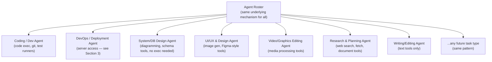
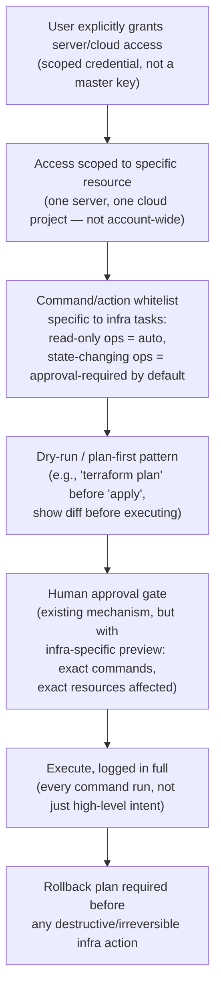
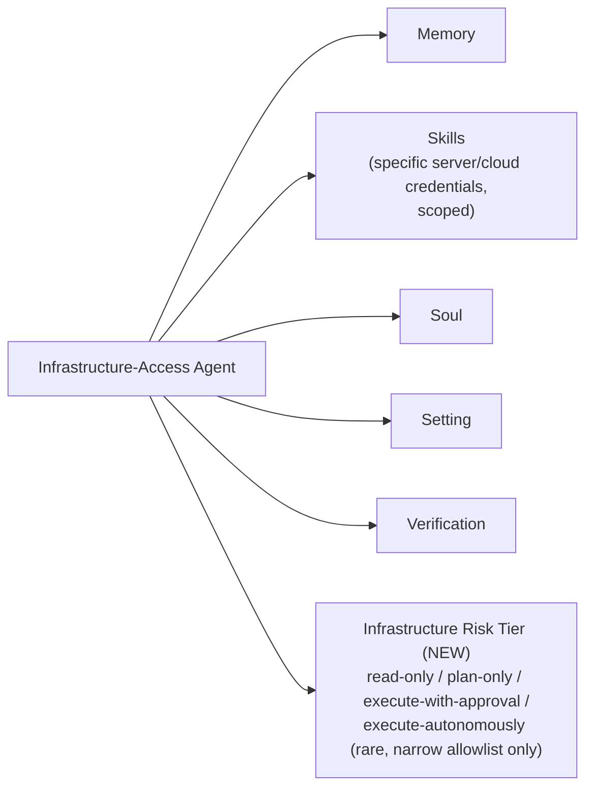
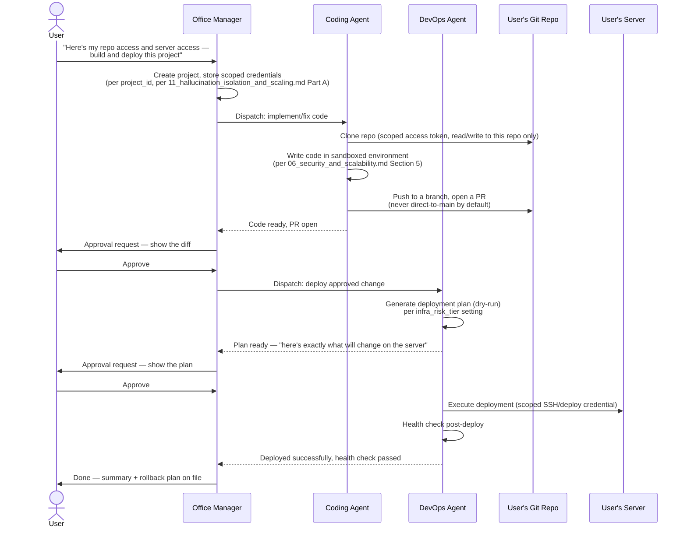

# Universal Task Coverage & Infrastructure-Access Agents

Part of the AI Employee Office Platform documentation set. See `00_INDEX.md` for the full document list.

You asked for the system to work on "anything digital" — cloud DevOps, deployment, system design, DB design, working with server access you grant it, coding, UI/UX, planning, research, editing, graphics, video editing, and more. This document answers two questions honestly: **does the architecture already support this** (mostly yes), and **what's genuinely new and needs careful treatment** (server/infrastructure access specifically — that's a different risk category from everything else on your list).

---

## 1. The good news: the architecture already generalizes

Nothing about the agent roster model is hardcoded to a fixed list of task types. Per `04_database_design.md` Section 2.3, an `agent` is just a config — Soul (persona/prompt), Skills (tool whitelist), Memory (scope), Setting (model tier, budget, action whitelist). This means every task type on your list is **"create an agent with the right tools and prompt," not "add a new feature to the platform."**

Each of these differs only in **which tools are whitelisted and which model tier is appropriate** — the orchestration, routing, budget-guard, and approval-gate machinery from `03_system_design.md` and `06_security_and_scalability.md` applies identically to all of them. This is the payoff of building the agent-roster abstraction properly rather than hardcoding a fixed set of "agent types" — you don't need new platform features to add a Video Editing Agent next month, just a new agent config and the right tool integrations.

---

## 2. What's genuinely new work per task category — tool integrations, not architecture

Where real engineering effort is needed is **tool integrations** — giving an agent the actual capability to act in each domain. This table is the honest scope:

| Task category | What tools an agent needs | New engineering work required |
|---|---|---|
| Coding / development | Code execution sandbox, git operations, test runners, package managers | Sandboxed execution environment (already scoped in `06_security_and_scalability.md` Section 5) |
| System design / DB design | Diagramming tools (e.g., mermaid generation, ERD tools), schema analysis | Mostly prompt/output-format work — low new engineering |
| Cloud DevOps / deployment | **Server access, cloud provider APIs, infrastructure-as-code execution** | **Significant — this is Section 3 below, a distinct risk category** |
| UI/UX & graphic design | Image generation APIs (e.g., Flux/SDXL via Replicate), design-file manipulation | Moderate — mostly API integration work |
| Video editing | FFmpeg scripting, video generation APIs (e.g., Runway/Kling) | Moderate — media processing pipeline, larger file handling |
| Research & planning | Web search/fetch (already built), document synthesis | Already covered in existing docs |
| Proofreading / writing / marketing | Text generation only, no special tools | Already covered — lowest-effort category |

**The honest scope statement**: most of your list is "give an agent the right API/tool access," which is genuinely tractable and doesn't require new platform architecture. **One category — server/infrastructure access — is categorically different and deserves its own security treatment**, because a coding agent that can execute arbitrary commands against a real server you've granted it access to is a fundamentally higher-risk capability than a writing agent or even a sandboxed coding agent.

---

## 3. Infrastructure-access agents (server access, cloud DevOps, deployment) — the real new risk

This is the part of your request that needs genuine new design, not just "add a tool."

### 3.1 Why this is different from everything else

Every other agent type in this system operates inside boundaries you already control tightly: a sandboxed container (`06_security_and_scalability.md` Section 5), scoped API calls, or pure text generation. **An agent with server access, by definition, can affect systems outside your sandbox** — a customer's actual production server, cloud account, or deployment pipeline. This is a different trust model, and it should be treated that way explicitly, not folded into the general "coding agent" category.

### 3.2 Required safeguards, specific to infrastructure-access agents

- **Scoped credentials, never account-wide access.** When a user grants "server access," the credential should be scoped as narrowly as the underlying platform allows — an SSH key limited to one host, a cloud IAM role limited to one project/resource group, never a root/admin credential covering everything the user has access to. This is an extension of the least-privilege principle already established in `12_adversarial_security.md` Section 6, applied specifically to infrastructure.
- **Read-only operations can be more liberally automated** (checking server status, viewing logs, listing resources) — these carry little risk and are exactly the kind of task where autonomous execution is genuinely valuable (e.g., "check why the server is slow" overnight).
- **State-changing operations default to approval-required**, consistent with the existing action-whitelist default-deny policy (`06_security_and_scalability.md` Section 4) — deploying, restarting services, modifying infrastructure, deleting resources. This isn't a new policy, it's the existing policy applied to a domain where the stakes of getting it wrong are unusually high.
- **Dry-run-first is a hard requirement, not a nice-to-have**, for anything that supports it. Infrastructure-as-code tools (Terraform, Pulumi, Ansible) already have this pattern built in (`plan` before `apply`) — the agent should always run and surface the plan/diff before executing, and the approval-gate UI (`10_ui_ux_guide.md` Section 14) should show that diff, not a vague summary, mirroring the same principle already established for code-change approvals.
- **Full command-level logging**, not just task-level summaries — every actual command executed against the server, in the `task_steps` audit trail. This is the infrastructure-domain version of the transparency principle already established for the general audit log (`04_database_design.md` Section 2.5).
- **Rollback plan required before irreversible actions.** For destructive operations (deleting a database, terminating a server), the agent should be required to state and verify a rollback/recovery path exists *before* the approval request is even shown to the human — an approval screen that says "this is irreversible and I have no rollback plan" is a very different (and much scarier) request than "this is reversible via X."

### 3.3 New agent config field: infrastructure risk tier

Extends the Verification field added in `11_hallucination_isolation_and_scaling.md` Section 4 — infrastructure-access agents get one more config dimension:

- `read-only`: monitoring, log review, status checks — safe to run fully autonomously, including overnight.
- `plan-only`: agent can generate deployment plans/diffs but never applies them without explicit approval — this should be the default for any newly configured infrastructure agent.
- `execute-with-approval`: can apply changes, but every state-changing action requires the dry-run + approval flow from Section 3.2.
- `execute-autonomously`: reserved for a narrow, explicitly user-approved allowlist of specific, well-understood, reversible actions (e.g., "restart this specific service if health check fails") — never a blanket grant, and should require deliberate, informed opt-in with clear warnings, not a default anyone stumbles into.

### 3.4 What this means practically for your own use (Phase 0)

Since you're a full-stack engineer who will likely want this capability early for your own client work (deploying client projects, managing client servers), this isn't a distant Phase 3 feature — it's realistic to want in Phase 1. The recommendation: **build the plan-only tier first**, since it delivers real value (an agent that can propose infrastructure changes, show you the diff, and only needs a click to execute) without the highest-risk autonomous-execution surface — then extend to `execute-with-approval` once the dry-run/rollback patterns are proven reliable in practice, and treat `execute-autonomously` as something you earn trust into over time, not something you ship early.

### 3.5 Direct answer: can this system take a user's server + git access and build/deploy their project end to end?

**Yes — this is squarely what the architecture already supports, using components already specified elsewhere in this doc set.** Concretely:

This is not new architecture — it's the existing pieces composed together:

- **Project isolation** (`11_hallucination_isolation_and_scaling.md` Part A) scopes the server/git credentials to this specific client project, so they're never reachable by an agent working a different client's job.
- **Sandboxed code execution** (`06_security_and_scalability.md` Section 5) is where the Coding Agent actually writes and tests code — never directly against the user's server.
- **Git access is itself scoped and least-privilege** (`12_adversarial_security.md` Section 6) — a token limited to the specific repo, not the user's entire GitHub/GitLab account, following the same identity-abuse prevention already specified for any agent credential.
- **PR-based code delivery, not direct commits to main** — mirrors the existing principle that deployment actions "produce a diff/PR for human review rather than pushing directly" (`06_security_and_scalability.md` Section 5), applied here to the code-authoring step specifically.
- **Dry-run-first deployment** (Section 3.2 above) — the DevOps Agent always generates and shows a plan before touching the real server, using the same pattern already established for infrastructure changes generally.
- **Two separate approval gates** — one for the code change (the PR/diff), one for the deployment itself (the infra plan) — because these are two distinct, separately consequential decisions, and collapsing them into one approval would hide real information from the user at the moment they're deciding.
- **Post-deploy health check + rollback plan on file** — directly required by Section 3.2's "rollback plan required before irreversible actions" rule.

**What determines how autonomous this can be, in practice**: the agent's `infra_risk_tier` and `clarification_mode` settings (`15_performance_training_and_settings.md` Sections 4 and 5) — a user who trusts the pipeline can set the DevOps Agent to `execute-with-approval` (deploy automatically once the code PR is merged, only pausing for the deploy-plan approval) or, for a well-understood, low-risk deployment target, eventually `execute-autonomously` for specific narrow actions like "redeploy on every merge to main" — but neither of those is the starting default, per Section 3.4 above.

---

## 4. Practical agent-template roster to launch with

Given the architecture already generalizes, the practical question is which agent templates to actually pre-build (per the "agent templates library" in the main requirements doc, Section 5.1) rather than making every customer configure from scratch:

| Template | Model tier default | Tool access |
|---|---|---|
| Coding Agent | Mid, escalate to frontier for hard bugs | Sandboxed code execution, git, test runners |
| DevOps/Deployment Agent | Mid | Scoped server/cloud credentials, infra risk tier = plan-only by default |
| System/DB Design Agent | Mid-to-frontier (design quality matters) | Diagramming/schema tools, no execution needed |
| UI/UX Design Agent | Mid | Image generation API, no execution needed |
| Video/Graphics Agent | Mid, frontier for complex generation | Media processing tools, generation APIs |
| Research Agent | Cheap-to-mid | Web search, fetch |
| Writing/Proofreading Agent | Cheap-to-mid | None beyond text generation |
| Marketing/Brand Agent | Mid | Web search (competitive research), image search |

This table is the practical starting roster — matches "anything digital" from your request while keeping the infrastructure-access category (the one genuinely new risk surface) clearly separated and appropriately cautious by default.
