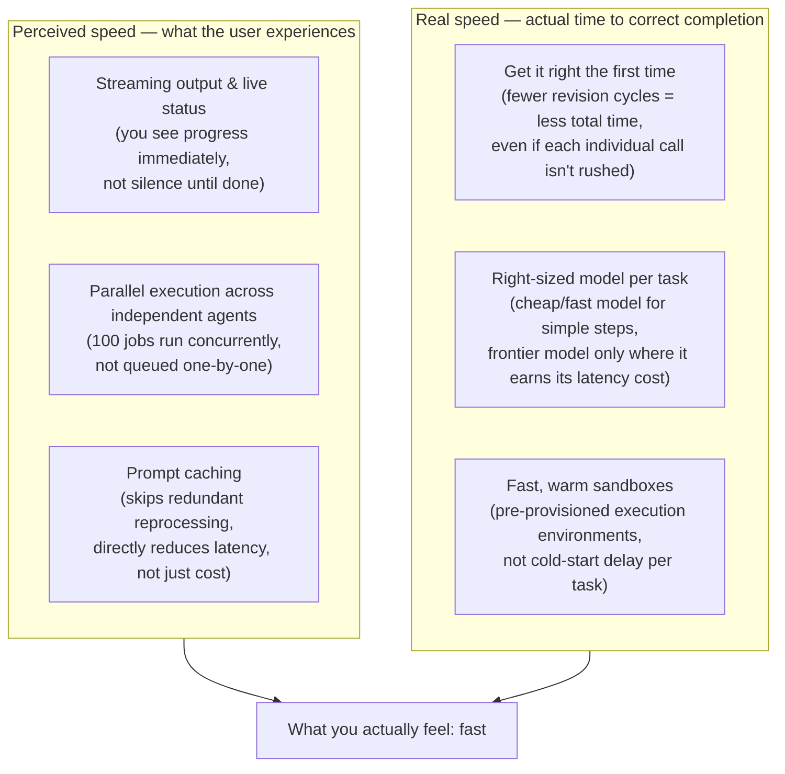
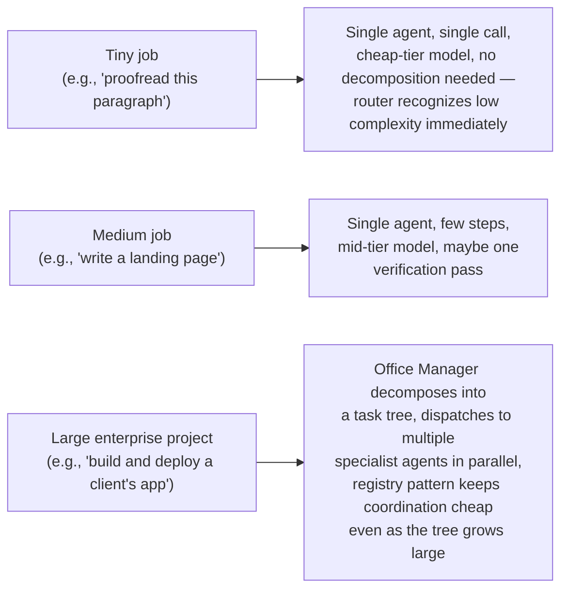
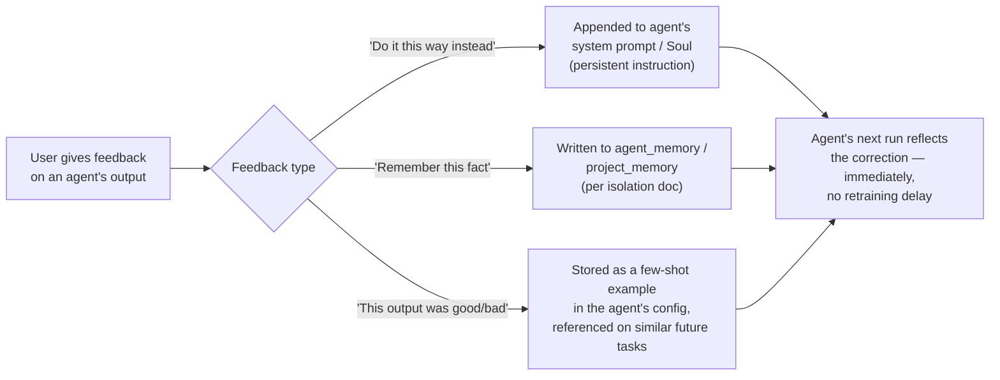
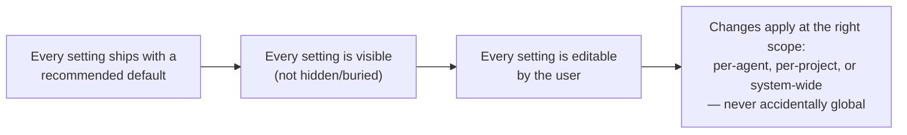
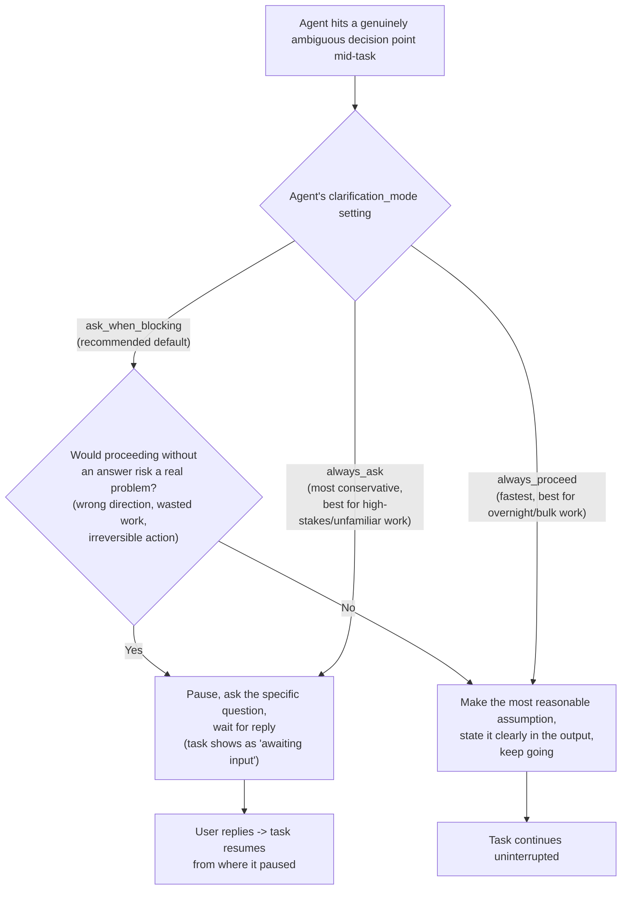

# Performance, Agent Training & User-Controllable Settings

Part of the AI Employee Office Platform documentation set. See `00_INDEX.md` for the full document list.

This document covers five things from your requirements: (1) making the system genuinely fast — at any scale, from a tiny task to a full enterprise client project — while keeping the best output at the lowest possible cost, (2) research tasks specifically, where speed must not come at the cost of actually gathering real data, (3) letting people train/customize their agents over time, (4) reaffirming and cross-referencing tenant data isolation (already solid — see below for exactly where), and (5) giving users real control over every agent and system setting, including whether an agent asks clarifying questions or proceeds on its own judgment.

---

## 1. Speed at every scale, without trading away quality or cost

### 1.1 Clarifying the actual target

Your clarification matters: the goal isn't to out-benchmark any specific competitor tool — it's that **the system should feel fast for any job, tiny or enterprise-scale, while still producing the best output at the lowest cost.** Those are three simultaneous constraints (speed, quality, cost), not a speed-vs-quality tradeoff to pick a point on. The earlier research into Cursor vs. Claude Code is still useful context — it showed that perceived speed and raw quality aren't actually in tension the way "fast tool vs. good tool" framing suggests: <cite index="130-1">Claude Code uses roughly 5.5x fewer tokens than Cursor for identical tasks, needs far fewer revision cycles, and won 67% of a blind quality comparison</cite> — meaning getting it right the first time is often the faster *and* cheaper *and* better-output path, all three at once. That's the principle this section builds on, not "match Cursor's latency."

### 1.2 Why scale (tiny job to enterprise project) changes what "fast" requires

Before designing around this claim, it's worth being precise about what's true, since building the wrong lesson into the architecture would hurt output quality for no real speed gain. Current benchmarks show a more nuanced picture than "Cursor is faster":

- <cite index="131-1">Claude Code actually has higher raw token throughput (90 tokens/sec vs. Cursor's 85 tokens/sec) — Cursor's perceived speed advantage comes from its inline-diff editing UI completing the interactive loop faster on simple-to-moderate tasks, not from faster underlying generation.</cite> <cite index="131-1">On tasks producing large outputs, that same inline-diff rendering actually adds overhead (1.5-3 seconds per render cycle).</cite>
- <cite index="137-1">The real distinction is interaction pattern: Cursor's tab-completion is sub-second because you stay in the loop guiding it turn-by-turn; Claude Code feels slower per turn (30-90 seconds) because it's doing real autonomous work between turns — "type, see suggestion, accept" vs. "write goal, walk away, come back" are different jobs, not the same job at different speeds.</cite>
- <cite index="130-1">Claude Code uses roughly 5.5x fewer tokens than Cursor for identical tasks, required significantly fewer manual revision cycles, and won 67% of a blind quality comparison on correctness and completeness.</cite>

**The conclusion this changes for your system**: your Office Manager delegates autonomous background work — structurally closer to Claude Code's "write goal, walk away, come back" pattern than Cursor's tight interactive loop. Chasing Cursor's specific speed advantage (inline, human-in-the-loop, sub-second edits) isn't the right target for an autonomous multi-agent office. The right target is: **feels fast because you get useful, correct, streaming progress continuously — not because any single call is rushed at the cost of quality.**

### 1.2 The actual levers for speed, without trading away quality



**Streaming, not batching, is the single highest-leverage change for perceived speed.** The existing WebSocket task-status protocol (`05_api_design.md` Section 5) already streams step-by-step events — the requirement here is to make sure every agent implementation actually emits granular step events (tool call started, tool call completed, draft generated) rather than going silent and returning one big result at the end. This alone makes a 60-second task *feel* far faster than the same task returning nothing until it's done.

**Parallelism is the second lever, and it's structural, not a tuning knob.** Since your Office Manager already uses the registry/focus-session pattern (`11_hallucination_isolation_and_scaling.md` Part C) specifically to handle 100 simultaneous jobs, independent jobs should genuinely run in parallel — <cite index="122-1">independent subtasks run simultaneously, and wall-clock time drops roughly proportional to the number of parallel branches, appropriate when subtasks are genuinely independent, like different research queries or multiple candidate generations.</cite> This means: **the platform's actual capacity to run many jobs at once (bounded by your LiteLLM gateway's rate limits and your budget guard, not by artificial serialization) is itself a speed feature** — a customer with 5 tasks queued should see all 5 progressing, not waiting in a single-file line.

**Right-sized model selection (already in place via Auto mode, `03_system_design.md` Section 5) is also a genuine speed lever, not just a cost one** — a cheap/fast model responding in 2 seconds for a simple sub-task beats a frontier model taking 15 seconds for the same simple sub-task, with no quality loss since the task didn't need the frontier model's extra capability in the first place. Cost-optimal and speed-optimal point the same direction here, which is a fortunate alignment worth stating explicitly.

**Get-it-right-the-first-time is the quality-preserving speed lever**, directly informed by the Claude Code data above: <cite index="130-1">fewer manual revision cycles is a bigger total-time win than a faster first draft that needs correcting.</cite> This is exactly why the hallucination/groundedness verification step from `11_hallucination_isolation_and_scaling.md` Part B isn't a speed tax — a task that passes verification and doesn't bounce back for a human correction cycle is faster end-to-end than one that returns quickly but wrong.

**Warm sandboxes for code execution** — per `06_security_and_scalability.md` Section 5, sandboxed execution is required for coding/infrastructure agents; the speed-relevant addition is keeping a small pool of pre-warmed sandbox containers ready rather than cold-starting one per task, which can otherwise dominate total task latency for short coding tasks.

### 1.3 Scaling from a tiny job to a full enterprise project — the same architecture, different shape of work

This is the part your clarification specifically calls out: the system needs to be fast and cheap for a 30-second task *and* for a multi-week enterprise engagement, without being two different systems.



- **The router's classification step (`03_system_design.md` Section 6) is what makes this automatic** — a tiny job is classified as low-complexity and never touches the decomposition/multi-agent machinery at all, going straight to a single cheap-tier call. There's no fixed overhead tax on small jobs from having a sophisticated system underneath; the sophistication only activates when the job actually needs it.
- **A large enterprise project doesn't get slower per-unit-of-work as it scales**, specifically because of the registry/focus-session pattern already built for the 100-simultaneous-jobs case (`11_hallucination_isolation_and_scaling.md` Part C) — the same mechanism that keeps the Office Manager cheap and accurate across 100 *unrelated* jobs also keeps it cheap and accurate across 100 *sub-tasks of one large job*, since a large project decomposed into many parallel specialist-agent tasks is structurally the same coordination problem.
- **Cost scales with actual work done, not with system overhead** — a tiny job costs a fraction of a cent (one cheap-tier call), a large enterprise project costs proportionally to its real complexity (many calls, some at higher tiers where genuinely needed), but neither pays a tax for the platform's sophistication existing. This is the concrete meaning of "cheapest cost for any kind of task, from tiny to enterprise" — the architecture doesn't have a fixed floor cost that makes small jobs wastefully expensive, and doesn't have runaway coordination overhead that makes large jobs disproportionately expensive either.

### 1.4 Research tasks specifically — speed must not compromise actually gathering real data

You flagged this directly: research needs to stay fast and cheap, but it must not sacrifice properly collecting real data to get there. This is a real tension worth naming rather than glossing over — the fastest possible "research" would be the model answering from memory with no lookups at all, which is exactly the failure mode `11_hallucination_isolation_and_scaling.md` Part B was built to prevent.

- **Retrieval-before-generation stays mandatory for research tasks regardless of speed pressure** — per `11_hallucination_isolation_and_scaling.md` Section 5, this is already a hard requirement, not a toggle that speed optimization should ever bypass.
- **Parallel search queries, not sequential ones, is where research gets faster without cutting corners on data quality** — <cite index="122-1">independent subtasks (different research queries, multiple candidate generations) run simultaneously with wall-clock time dropping roughly proportional to parallel branches</cite> — a research agent investigating five sub-questions should fire five searches concurrently, not one after another, which speeds up the *gathering* itself rather than skipping it.
- **The cheap-tier model handles search-query formulation and result triage; a stronger tier handles synthesis** — this is the same Auto-mode tiered routing applied to the shape of a research task specifically: many cheap classification/triage calls (which sources are actually relevant) feeding into fewer, higher-quality synthesis calls, which is both faster and cheaper than running the whole research pipeline on one tier.
- **The research agent's Verification setting (`11_hallucination_isolation_and_scaling.md` Section 5) should default to on for anything client-facing** — speed optimization elsewhere in the pipeline (parallel search, tiered synthesis) should never be the justification for skipping this step; it's a separate lever, not a competing one.

### 1.5 What this explicitly does NOT mean

To be clear about the tradeoff being rejected: this system will **not** silently downgrade to a faster-but-worse model to hit a speed target, will **not** skip the verification/groundedness step to shave seconds off client-facing work, and will **not** let a research agent shortcut real data collection to appear fast. Speed is pursued through parallelism, streaming, right-sizing, scale-appropriate decomposition, and get-it-right-once — never through quietly trading away quality or real data gathering. If a genuine speed/quality tradeoff ever needs to be made, it should be a visible setting (see Section 5 below), not a silent default.

---

## 2. Agent training — letting people improve their agents over time

You asked for people to be able to "train up their agents." This needs to be split into two genuinely different tiers, because they have very different cost and complexity profiles — and per your cost-first priority, the cheap tier should be the default path, not an afterthought before a jump to expensive fine-tuning.

### 2.1 Tier 1 (default): prompt, memory, and feedback-based improvement — no model training required

<cite index="138-1">The practical guidance from current agent-building practice is direct: start with the simplest approach that meets your reliability needs — a well-crafted prompt combined with solid retrieval is often more effective and easier to maintain than a fine-tuned model.</cite> This tier requires no new infrastructure beyond what's already documented:



- **Thumbs up/down + comment on any task result** (a UI element on the Task Detail page, `10_ui_ux_guide.md` Section 13) feeds directly into the agent's Soul (system prompt refinement) or Memory (fact storage), depending on what kind of feedback it is.
- **"Teach me" mode**: a user can have a direct conversation with an agent specifically about how it should behave differently going forward — e.g., "for this client, always use British English spelling" — which gets distilled into a persistent instruction added to that agent's Soul, scoped to the right project per the isolation model in `11_hallucination_isolation_and_scaling.md` Part A.
- **This is immediate** — no training run, no delay, no extra infrastructure. The very next task that agent runs reflects the correction. This should be the default, prominently surfaced way people "train" their agents.

### 2.2 Tier 2 (advanced, opt-in): real fine-tuning

For customers who want an agent's underlying behavior genuinely adapted at the model level — not just prompted differently — real fine-tuning is a legitimate but more expensive path, and should be explicitly opt-in, not a default:

- <cite index="141-1">Modern reinforcement fine-tuning (RFT) approaches like GRPO let an agent improve through trial and error against a reward signal, rather than needing hand-labeled examples — the model generates multiple completions and learns from their relative ranking against each other.</cite>
- <cite index="144-1">This works by having the agent call your real tool endpoints during training rollouts, learning from actual tool responses, with custom reward signals defined via flexible graders (model-based, endpoint-based, or string-based) — directly applicable to your agents' real tool use (code execution results, search relevance, task completion criteria).</cite>
- **Cost and complexity reality check**: this requires a labeled/reward-defined dataset of the agent's own task trajectories, compute for the training run itself, and evaluation infrastructure to confirm the tuned version is actually better before deploying it — a meaningfully bigger investment than Tier 1. <cite index="138-1">The right sequencing is explicit: pick one narrow, high-value use case, build an evaluation harness first, define what "good" looks like before writing any training code — fine-tuning without this discipline just produces an agent that's confidently different, not reliably better.</cite>
- **Recommendation**: offer this only once Tier 1 (prompt/memory-based) has been in production and generating real usage data — that data becomes the training corpus, and you'll have real evidence of which agents/tasks would actually benefit from fine-tuning rather than guessing upfront. This is a Phase 3+ feature, not a Phase 0-1 one.

### 2.3 Schema addition

```sql
CREATE TABLE agent_feedback (
    id UUID PRIMARY KEY DEFAULT gen_random_uuid(),
    tenant_id UUID NOT NULL REFERENCES tenants(id),
    agent_id UUID NOT NULL REFERENCES agents(id),
    task_id UUID REFERENCES tasks(id),
    feedback_type TEXT NOT NULL,  -- 'thumbs_up' | 'thumbs_down' | 'correction' | 'teach_instruction'
    feedback_text TEXT,
    applied_to TEXT,  -- 'soul_prompt' | 'memory' | 'few_shot_example' | 'pending_review'
    created_at TIMESTAMPTZ NOT NULL DEFAULT now()
);
```

`applied_to = 'pending_review'` matters for anything that would meaningfully change agent behavior — a user's "teach me" instruction should show up for confirmation (e.g., "I've updated this agent's instructions to always use British English for this client — confirm?") rather than silently rewriting the Soul prompt on every piece of feedback, which could otherwise let one careless correction degrade an agent that was working well.

---

## 3. Tenant data isolation — already solid, reaffirmed and cross-referenced

**This was already a first-class requirement in the existing docs — not new, but worth restating plainly since you raised it again:** cross-tenant leakage is Threat 1 in `06_security_and_scalability.md`, addressed structurally (not just by policy) via:

- Row-Level Security on every tenant-scoped Postgres table, enforced at the database level (`06_security_and_scalability.md` Section 2)
- Redis key namespacing per tenant (`06_security_and_scalability.md` Section 2)
- Object storage path-prefixing per tenant with signed URLs (`06_security_and_scalability.md` Section 2)
- Vector memory queries always filtered by `tenant_id` before similarity search (`06_security_and_scalability.md` Section 2)
- A second, finer-grained layer *within* a tenant — the `project_id` isolation model for separate clients under one account (`11_hallucination_isolation_and_scaling.md` Part A)

Nothing new needs to be added here architecturally — the one thing worth adding given this document's focus on agent training (Section 2 above): **`agent_feedback` entries are tenant- and project-scoped exactly like `agent_memory`**, so feedback given on one client's project can never influence how an agent behaves on a different client's project, consistent with the isolation model already established.

---

## 4. User-controllable settings — with sensible defaults

You want real control over every agent and system setting, not a black box, while keeping good defaults for people who don't want to tune anything. This is a design principle that threads through every settings surface already documented — this section makes it explicit as its own requirement and shows where each control lives.

### 4.1 The principle



### 4.2 What's already controllable, consolidated in one place for clarity

| Setting | Default | Where it's configured | Doc reference |
|---|---|---|---|
| Model selection mode (Auto/Manual) | Auto | Agent config, Setting tab | `03_system_design.md` Section 5 |
| Pinned model (if Manual) | None (only used in Manual mode) | Agent config, Setting tab | `03_system_design.md` Section 5 |
| Budget cap per task | Conservative platform default | Agent config, Setting tab | `04_database_design.md` Section 2.3 |
| Action whitelist (auto vs. approval-required, per action type) | Default-deny for external/irreversible actions | Agent config, Setting tab | `06_security_and_scalability.md` Section 4 |
| Tool whitelist | Minimum implied by agent's stated role | Agent config, Skills tab | `12_adversarial_security.md` Section 6 |
| Groundedness/citation verification | On for client-facing/factual tasks, off for pure creative tasks | Agent config, Verification tab | `11_hallucination_isolation_and_scaling.md` Section 5 |
| Infrastructure risk tier (for DevOps/server-access agents) | `plan-only` | Agent config, Setting tab | `14_universal_task_coverage.md` Section 3.3 |
| Clarification behavior (ask vs. proceed on ambiguity) | `ask_when_blocking` | Agent config, Setting tab | This document, Section 5 |
| Preferred interface (office UI / chat GUI / Telegram / etc.) | Chat GUI | User account settings | `10_ui_ux_guide.md` Section 16 |
| Voice on/off, language (auto-detect, or pick manually from supported languages) | Auto-detect | User account settings | Main requirements doc Section 7.3 |
| BYO provider pattern (direct key / OpenRouter / custom endpoint) | N/A — set explicitly by BYO customers | Settings > API Keys | `13_byo_provider_architecture.md` Section 3.5 |
| Per-tenant nightly aggregate spend cap | Set during onboarding, editable anytime | Settings > Plan & Billing | `06_security_and_scalability.md` Section 4 |

### 4.3 What's new here: a system-wide default profile, plus per-agent override

The table above shows controls that already exist per-agent. What was missing is a **tenant-level default profile** — so a new agent a customer creates doesn't start from a bare platform default, but from *their own* established preferences:

```sql
CREATE TABLE tenant_default_settings (
    tenant_id UUID PRIMARY KEY REFERENCES tenants(id),
    default_model_selection_mode TEXT NOT NULL DEFAULT 'auto',
    default_budget_cap_usd NUMERIC NOT NULL DEFAULT 2.00,
    default_groundedness_check BOOLEAN NOT NULL DEFAULT true,
    default_infra_risk_tier TEXT NOT NULL DEFAULT 'plan_only',
    updated_at TIMESTAMPTZ NOT NULL DEFAULT now()
);
```

When a new agent is created (manually or via the meta-agent), its initial config is seeded from `tenant_default_settings`, not a hardcoded platform default — so a customer who's decided "I always want a higher budget cap" or "I always want Manual mode with Opus" only has to set that once, at the tenant level, rather than repeating it for every new agent. Per-agent settings remain fully overridable after that seeding — the tenant default is a starting point, never a lock.

### 4.4 UI surface

Extends `10_ui_ux_guide.md` with a new Settings sub-page:

```
┌─────────────────────────────────────────────────────────┐
│  Settings > Defaults for New Agents                          │
├─────────────────────────────────────────────────────────┤
│  Model selection:  ○ Auto (recommended)  ○ Manual: [___]      │
│  Default budget cap per task:  $[2.00]                        │
│  Default verification level:  ☑ Groundedness check (recommended)│
│  Default infrastructure risk tier:  [Plan-only ▾] (recommended) │
│                                                                │
│  These are starting points for any new agent you create —      │
│  you can always change an individual agent's settings later.   │
└─────────────────────────────────────────────────────────┘
```

This closes the loop on "users can control and tweak settings of all of the agents or the system, with sensible defaults" — control exists at both the individual-agent level (already documented across several docs) and now at the tenant-wide default level (new in this document), with every default clearly labeled as a recommendation, not a locked choice.

---

## 5. Clarification behavior — does an agent ask and wait, or use its best judgment and proceed?

This is a genuinely new, previously-missing control. You asked it plainly: can a user tweak whether an agent asks a question and waits for a reply mid-task, versus just doing what it thinks is best? This deserves its own explicit setting, not an implicit behavior buried in a system prompt somewhere — because it directly interacts with your overnight-autonomy requirement (an agent that stops and waits at 2 AM defeats the point of unattended execution) and with speed (excessive clarifying questions slow everything down; too few risk the agent guessing wrong on something that mattered).

### 5.1 The underlying principle, from current agentic design practice

<cite index="147-1">The right general approach is well-established: agents should recognize uncertainty, seek information when available, make reasonable assumptions when information isn't available, and expose those assumptions to the user rather than silently guessing — using available tools to look something up first, asking a clarifying question only if the user can efficiently supply the missing information, and otherwise making an explicit, stated assumption and proceeding rather than stalling.</cite> This is the right *default behavior* — but you specifically want it to be a **user-controllable setting**, not just a fixed built-in policy, which is the right instinct: different tasks, different clients, and different working styles genuinely call for different tradeoffs here.

### 5.2 The setting — three modes, per agent



- **`ask_when_blocking` (recommended default)**: the agent uses judgment about whether the ambiguity is actually consequential. A genuinely blocking ambiguity (e.g., "should I deploy to staging or production?" — getting this wrong is costly or irreversible) triggers a pause-and-ask. A non-blocking ambiguity (e.g., "should this button be blue or navy?" — either is a reasonable default, easily corrected later) gets a stated assumption and the agent proceeds. This matches <cite index="147-1">the general "seek clarification only when the user can efficiently provide missing information and it matters" principle</cite> as a live, per-decision judgment rather than a blanket policy.
- **`always_proceed`**: the agent never pauses to ask — it always makes its best-judgment assumption, states it in the output/audit trail, and keeps working. This is the right mode for overnight/unattended runs (an agent that can't ask has to proceed or the whole point of "work while I sleep" breaks) and for bulk/low-stakes work where a few wrong assumptions are cheap to fix compared to the cost of stopping and waiting on every one.
- **`always_ask`**: the agent pauses on any meaningful ambiguity, however minor, and waits for your input. Best for a new client relationship, an unfamiliar task type, or genuinely high-stakes work where you'd rather be interrupted than have anything assumed — the tradeoff being explicitly accepted here is slower completion in exchange for maximum alignment with your intent.

### 5.3 How this interacts with overnight autonomy specifically

This setting needs a companion rule for unattended execution, since "wait for a reply" doesn't make sense with nobody there to reply:

- **A task explicitly flagged for overnight/unattended execution (`allow_overnight: true`, per `05_api_design.md` Section 4.2) automatically behaves as `always_proceed` for that run, regardless of the agent's configured default** — this isn't a separate setting to remember, it's a sensible automatic override, since a pending "awaiting input" task that nobody's there to answer would otherwise just sit idle all night, defeating the purpose.
- **Every assumption made during an overnight run is logged in the `task_steps` audit trail and surfaced prominently in the morning summary** (per `03_system_design.md` Section 7's overnight execution flow) — so even though the agent didn't stop to ask, you see exactly what it assumed and why when you wake up, and can correct anything that guessed wrong. This is the same transparency principle as everywhere else in this system: proceeding on an assumption is fine, proceeding *silently* is not.
- **If an ambiguity is genuinely blocking even for an overnight-flagged task** (e.g., truly cannot proceed without a decision only you can make, not just "would prefer to know"), it should fall through to the existing approval-queue mechanism (`06_security_and_scalability.md` Section 4) rather than either guessing dangerously or stalling — the same pattern already used for consequential actions, applied here to consequential *decisions*.

### 5.4 Schema and UI

```sql
ALTER TABLE agents ADD COLUMN clarification_mode TEXT NOT NULL DEFAULT 'ask_when_blocking';
-- 'ask_when_blocking' | 'always_proceed' | 'always_ask'
```

```
┌─────────────────────────────────────────────────────────┐
│  Setting tab (agent config)                                  │
├─────────────────────────────────────────────────────────┤
│  When this agent hits an ambiguous decision:                  │
│  ○ Ask only if it really matters (recommended)                 │
│  ○ Always proceed with its best judgment                        │
│  ○ Always ask and wait for my input                              │
│                                                                │
│  ℹ Overnight/unattended tasks always proceed automatically —    │
│    you'll see every assumption made in the morning summary.      │
└─────────────────────────────────────────────────────────┘
```

Add this row to the settings table in Section 4.2 above: **Clarification behavior** — default `ask_when_blocking` — configured in Agent config, Setting tab — this document, Section 5.

